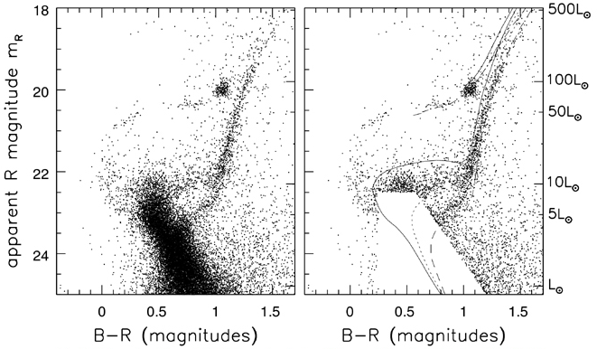
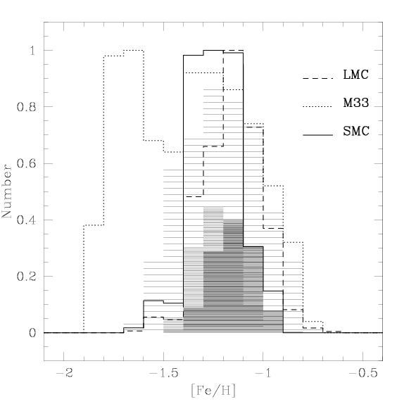

# 星系天文学

© Zhenbo, Su 

@ USTC, GalaxyAstronomy Course

Note: 研一上学期孔旭老师&张红欣老师的星系天文学ppt笔记整理。

[TOC]

# 第二章

## 2.1 太阳的邻域

* 恒星数目多少、种类有哪些

* 年轻、主序、年老恒星比例

* 坐标—描述恒星分布和运动

* 距离—测量恒星离我们远近
* 距离—测量恒星离我们远近
  * 绝对星等 -> HRD -> 恒星特性和演化

### 2.1.1 测距

* 三角视差测距
* 雷达测距 -- Light Echoes （太阳系）
* 三角视差法 -- parallax
  * 利用不同观测位置（apparent position） 测量同一物体的视差，测定物体（天体）距离的方法
  * 三角视差测量恒星距离：只适合测量太阳周围的恒星
* 依巴谷卫星
* 太阳附近恒星HRD
  * 依巴谷卫星数据库 （距离、颜色、视星等）
  * 颜色分类得到恒星光谱
  * 恒星时差测量恒星距离+视星等=绝对星等（m,d=M）
  * 颜色和绝对星等（HRD）
* 主星序宽：对于比太阳亮的恒星，主要是 因为它们的年龄不同；对于较暗的星，金 属丰度变化导致主序带比较宽

### 2.1.1 光度函数和质量函数

* 光度函数
  * 描述某一类天体在内禀光度上的 分布形式，常表示为每立方秒差距中某种光 度的恒星（星系）数目多少
  * $\phi(M_V)\Delta M_V$表示绝对星等介于$M_V$ 和 $M_V +\Delta M_V$间的恒星数密度。
  * 测量光度函数的困难
    * 亮端：亮天体数目很少，且恒星的空间分 布不均匀
    * 暗端：受星等极限影响，暗星观测不到或 很难发现
    * 双星、星协因靠得非常近难以区分，影响 光度函数
* 马姆奎斯特偏差(Malmquist bias)
  * 天文观测（恒星、星系）中，都存在一个流量限 -- 极限星等（mlim）：裸眼极限星等.
  * 流量限巡天：距离越远处的暗天体，被观测到的概率就越低，因而在较远距离上，低光度天体的数量，将会被过低估计
* 改正马姆奎斯特偏差→Volume Weighting
  * 在一个流量限（极限星等）样本里 ，样本中的所有天体的流量必须亮于流量限： $f > f_{min}$ or  $m < m_{lim}$
  * 每个恒星（星系）对光度函数的贡 献可以乘以一个权重因子：1/Vmax
    * Vmax 表示在某一极限星等时，某一 光度的恒星可以被观测的最大体积 （最远距离）
* 恒星对光度、质量的贡献
  * 几乎所有的光都来自较亮恒星
    * 稀少亮星对星系光度的贡献，远 多于比太阳(M V = 4.83)暗的恒星 对光度的贡献。星系总光度强烈依赖于它最近有 没有形成大质量的、短寿命的恒 星：SFH（恒星形成历史）。
  * **发出大多数光的亮恒星对质量 却没有什么贡献**
    * 红巨星质光比(M/L)比主序星还小，对质量贡献极微，太阳邻域，几乎全部的质量 都在K和M等晚型矮星中。
* 初始光度函数
  * 现在的光度函数（观测+改正） -- 初始光度如何分布？ 
  * 恒星演化模型（回溯）：每种 光度的恒星在诞生时刻有多少
  * 获得恒星初始光度函数$\phi(M_V)$
  * 计算初始光度函数：只要假设盘在其整 个历史中一直在以均匀的速率形成恒星, 即 SFR = const.
* 初始质量函数 (Initial Mass Function)
  * 初始质量函数：单位体积内新形成恒 星的相对数目在质量上的分布，ξ(M)。
    * ξ(M)ΔM是恒星诞生时，质量在M和M ＋ΔM之间的恒星数目
    * Salpeter’s IMF：
      * $\xi(M) = \xi_0M^{−2.35}$
  * 观测和理论表明：星云破碎后，形成的小质 量恒星数目远大于大质量恒星的数目.

## 2.2 银河系

### 2.2.1 运动学距离

* 恒星相对于太阳系（LSR）的运动速度 可分解成两个分速度
  * 视向速度Vr：朝向或远离观测者的速度分量 
    * 可利用恒星或气体光谱中的发射线或吸收线 的Doppler移动测量 
  * 切向速度Vt：恒星在天空横向视运动角速率
* 自行$\mu$：恒星相对于太阳系的质量中心，单位时 间其位置在角度上的变化，单位是“角秒/年” 
  * 自行$\mu$非常小，常以每年毫角秒(mas)测量；切向 速度Vt 是距离d 和自行 $\mu$ 的乘积

### 2.2.2 分光视差：盘的垂直结构

* 分光视差方法：知道恒星光谱型和视星等，测 量恒星距离的一种方法
  * 不需测量视差：只是因为和三角视差一样，可 以测恒星距离，故称做视差
  * 基础：假设“具有相同光谱型的恒星，光度相 同”。只适用于主序星。
  * 测量方法：
    * $m_V − M_V = 5lgd − 5$
    * 利用三角视差方法，测得近距离某 一光谱型恒星距离和视星等：光度
    * 假定更远的同光谱型恒星光度与近距恒星一样（光谱类型可以提供很好的绝对星等估计值）：测得远距离恒星视星等，即可求出远距恒星的距离d。
    * 光谱观测只能对比较亮的恒星 离极限大约在10,000 pc范围
* 测光视差：poor man 方法
  * 对许多暗星拍摄高质量的光谱，需要在大 望远镜上进行长时间观测
  * 变通办法：由恒星的颜色估计其光谱型， 并用其他指标来认定它是巨星还是矮星
  * 测光视差：利用恒星颜色等观测信息，确 定恒星光谱类型，计算恒星距离的一种方 法
* 为何较老的恒星有较大的标高?
  * 恒星在绕转时会受到银盘内和旋臂内的恒星和气体团块的引力作用 引力作用，使得恒星在径向运动和垂直方向运动速度会随时间累加 年龄较老的恒星，运动得更快，标高较大：较老恒星一般运动较快.
* 古尔德带 Gould's Belt
  * 银河系中横跨3,000光年直径 ，与银盘面夹角~16 -- 20°的恒星带
  * 由大量年轻O、B型恒星组成：星族→古尔德带大约形成于30--50Myr前
  * 起源：可能是一个暗物质泡(blob)与银河 系分子云碰撞，形成一个离开银盘的恒星 形成带。其他星系也发现了类似的结构

### 2.2.3 星团测距

* 星团：由十几颗至上百万颗 恒星组成 的有 共同 起源、相互之间有较强的力学联系的天体系统.
  * 星团有很多颗恒星组成 ， 亮度大 → 可以 更大范 围 的测距 ；从同一气态原始物质中几乎 同时形 成，金属丰度一样 → 可以更加精确测量距离
* 疏散星团 Open Clusters
  * 光度范围较大；中心密度可达 ~100L⊙pc-3
  * 核半径大小rc 一般为数秒差距（a few pcs）
  * 内部恒星具有小的随机速度，s < 1 km/s
  * 质光比M/L<1：随年龄增大，M/L会增加
  * 疏散星团多处于靠近银河系盘平面、旋臂
* 等龄线：年龄相同的各种质量的恒星 在赫罗图上的位置线
* 星团中所有恒星具有相同的年龄和 相同的重元素丰度，主序很窄
* 利用邻近星团观测，结合恒星演化理 论，把星团的颜色同其年龄和金属丰 度联系起来：颜色 → 年龄、金属丰度。观测其它星系中星团时，只需测量积 分光：将其颜色同银河系星团比较， 得到河外星系中星团年龄和化学组成
* 球状星团
  * 球状星团包含的恒星数目多，结构更紧密。
  * 内部恒星具有较高随机速度sr ；星族的金属丰度低，星族年老
  * 在核半径 rc 以内，恒星的数密度大 致为常数
  * 在潮汐半径或截断半径 r t 处，恒星 数密度锐降至零
* 球状星团测距
  * CMD方法：将观测到的星团CMD（HRD ）同恒星演化模型进行比较；调整假设的距离、年龄和元素丰度，获得最佳拟合
  * 变星方法：天琴座RR型变星 (L ≈ 50 L⊙ ) 或者造父变星周期-光度关系
* 银河系球状星团分布
  * 富金属球状星团在银河系内区为数较多，而且离中平面 较近；可能是同核球和厚盘一起形成的。
  * 贫金属球状星团围绕银河系中心形成一个大致球形：
    * 有红水平支的球状星团(相对年轻)，分布区域更加弥散
    * 有蓝水平支的球状星团(相对年老)，向银河系中心聚集
  * 多数贫金属球状星团不遵循圆轨道：晕星团的轨道几乎 是随机取向的，富金属球状星团像盘中的恒星一样旋转
* 晕区恒星：球状星团和晕星
  * 贫金属晕星
    * 贫金属晕星的总质量只有约109  M⊙ ，比盘或核球中的恒星总质 量小得多
    * 几乎所有蓝星都是晕星，而几乎 所有红星都在薄盘中：利用颜色 区分不同区域的星族？？？？

### 2.2.4 红外观测：核球

* 太阳在银盘附近，银盘中存在大量尘埃：观测研究银河系核球和核心的 最佳方法是使用红外（IR）观测

* 近红外图像显示银河系有一个扁平的中央核球：它贡献了银河系总光 ~ 20%；恒星金属丰度和年龄范围大

* 核球星族

* The bulge metallicity

  * 气体 耗散 了其主要的能量 ， 形成一个稳定 的旋转盘 ， 星系恒星形成 由内而外 ， 导致 星系中心金属丰度高，外面金属丰度低

* 银河系SFR估算

  * 取质光比M/L V ≈ 2 （星系的M/LV 介于2 - 10） 

  * 银盘光度 L V ∽ 1.5×10 10 L⊙ ；由质光比

    → 银盘恒星质量 M* ~ 3×10 10 M⊙ 

  * 为了在10Gyr内把盘建构起来，必须每 年产生（3－5）M⊙ 的恒星，即为SFR。

## 2.3 Galactic Rotation

* 较差自转
  * 较差自转：是指一个天体在自转时，不同部位 的角速度（$\omega$）互不相同的现象
    * 较差自转在大多数非固体的天体中存在，比如星 系、巨型气体行星等等
    * 由于旋涡星系的自转是较差自转，内部的自转角速度大于外部的角速度，旋 臂会越缠越紧，最终完全缠绕在一起：旋臂缠绕问题 → 密度波理论

### 2.3.1 测量银河系转动曲线

* 切点法测转动曲线
  * 转动曲线：描述星系各部分的转动速度与到转动轴距离的关 系曲线。其形状由星系中的质量分布所决定
  * 如能测量不同区域恒星的距离和速度，即得到转动曲线V(R)
    * 盘星和星团的辐射（UV-IR波段）受尘埃消光影响大 
    * HI21厘米辐射受尘埃影响小，但不知发射气体的距离
* The X-factor
  * X=$N(H_2)/W_{CO}$，CO的积分线强度（integrated line intensity）和H2的柱密度
* 电离氢（HII）
  * O、B等年轻恒星产生大量紫外光子（E > 13.6eV），将周围的氢分子（ H 2 ）裂解为 原子氢。
  * 紫外光子又将原子气体光致电离，产生一 个光致离解区，即HII区。
    * 斯特龙根球：是年轻的O、B型星周 围存在的电离氢区。
* Heating and cooling of ISM
  * Cooling：
    * 气体冷却：星系 形成极为重要过 程，冷却效率与 温度和密度有关
    * T$\geq10^{7}$K：
      * 气体完全电离，冷却 主要通过自由电子的韧致辐射
    * $10^{4}$K<T<$10^{6}$K：
      * 包括不同的激发 和退激发过程
        * 电子与离子复合，辐射光子。原子（or离子）与其他粒子碰撞 激发，后退激发到基态。不同的原子有不同的激发能，冷 却效率与气体化学组成相关。
    * T<$10^{4}$K：
      * 中性H和分子氢，碰撞 激发（弱）、分子转动、振动谱
* 气体的复合和冷却
  * 星际气体需要连续的能量供应：否则将迅速冷 却，云的随机运动逐渐减小，并最终耗散掉
  * 在HII区内，trec 只有几千 年。当恒星不再提供紫外 光子，电离气体便迅速复 合。温度越高，密度越小 ，复合时间越长。
* 银河系尘埃
  * Mdust/Mgas = 1%
  * Ldust/Lbol(MW) = 30%
  * 尘埃粒子小：尘埃能最有效地吸收波 长小于尘埃颗粒尺度的光，对紫外吸收有效 → 大多数尘粒尺度 r ≤ 0.3$\mu$m
  * 尘埃再辐射：尘埃吸收了银河系紫外 和光学波段的星光，又将吸收的能量 在红外波段进行辐射
  * 尘粒有不同尺寸：
    * 大尘粒（温度T ~ 30K）产生峰值在 100 $\mu$m的辐射。
    * T ≥ 100K的较热的颗粒辐射峰值在 30$\mu$m附近
    * 小尘埃粒子（PAHs）辐射短于30 $\mu$m
* Jeans’ Instability
  * 分子云内部，存在引力和因分子热运动产生的热压力
  * 当热压力足够高时，微小的密度涨落能够被热压力所克服， 不能塌缩
  * 当分子云的热压力不足以抵抗引力时，分子云会在引力的作 用下发生塌缩：称为金斯不稳定性
  * 

# 第四章 我们的后院：本星系群

## 4 ¶引言

### 定义（星系群、团，超星系团，本星系群）

暗物质存在和引力相互作用，使得星系在空间分布不是随机的：星系团、群

1. 星系群：

> 小规模星系的聚集体，星系数目一般少于50个，直径 ~ 1 - 2Mpc，质量$10^{13}$M$_\odot$；
>
> 群星系运动速度 $\sigma$ ~ 150 km/s，宇宙中星系分布最常见的结构，近邻宇宙的 > 50%的星系位于星系群中

2. 星系团：

> 比星系群大，但星系团和星系 群没有严格的区分；
>
> 团成员星系间由引力相互束缚，团成员星系之间存在大量热（$10^7$-$10^8$K）的星系际气体。

3. 超星系团：

> 星系群和星系团组成了超星系团。与星系团不同，超星系团成员星系之间不再受引力束缚，成员星系之间可以相互退行。

4. 本星系群:

> 以银河系和M31的公共重心为中心，半径约为 1.2 Mpc 的空间内的星系总称。

5. 两个质量最大的成员星系：

> 银河系与M31； M31比银河系亮约50%。
>
> 第三亮星系为M33，L(M33) ~ 0.2L(MW)； M31/MW/M33辐射了本星系群可见光 ~ 90%

6. 银河系的伴星系多数靠近一个平面； M31也有自己的一批伴星系；其他小星 系离大星系M31、MW很远，自由运动。

7. M31、MW、M33旋涡星系；M32为椭圆星系 其余是主要是矮星系（矮不规则星系，矮椭圆星系和矮椭球星系）

### 测量距离？

​	测量本星系群中星系之间的距离不能利用哈勃定律：

> 本星系群中 星系之间的相互引力非常强，克服了随宇宙膨胀（宇宙学红移），只能利用造父变星的周期 - 光度 关系等其它方法，测量距离

### 研究意义？Why the Local Group?

* 普适性：本星系群是宇宙中典型的星系环境，提供了研究星系特性的一般环境，

* 没有室女座或后发座星系团那样致密；但包含了足够质量，能将星系束缚在一起
* 多样性：不同类型的星系
  
  * 意味着质量、年龄、金属丰度很广
  * 光度类型的种类很多
  * 形成环境的种类很多（range of environments）
  
* 光度范围很广
  * MW/M31 ～ 2$\times 10^{10}$L$_\odot$
  * LMC ~ 2$\times10^{9}$L$_\odot$
  * Formax dSph $1\times10^7$L$_\odot$
  * Carina dSph $3\times10^5$L$_\odot$
* 距离近：为近距离研究星系提供了机会，
  * 分辨：可分辨这些邻近星系中单个恒星：利用观测的恒星颜色－星等图同恒星演化理论比较，研究星族形成 -- star formation histories
  * 测量：金属丰度、元素丰度、恒星气体运动学 -- chemical evolution
  * 相互作用：研究星系近距相互作用过程，对星系物理和性质的影响
* 恒星形成历史（Star Formation Histories）
  * 分析Color Magnitude Diagram （CMDs），同时展示了白矮星（dwarfs）里年老和一些年轻恒星 -- 复杂的恒星形成历史（complex SFH）
  * 白矮星不具有相同的SFH，尽管它们物理上接近并且处于束缚系统（bound system）（local group）中
  * 它们相对的化学含量（chemical abundances）体现了在银河系中一些低金属丰度恒星的区别。

* 恒星考古学（Stellar Archaeology）：

  > 通过解析当前的恒星种群来研究附近的星系

## 4.1 ¶银河系的伴星系

### 定义（大、小麦哲伦云）

* 是银河系最显赫的两个伴星系
* 只能在南半球看到，肉眼可见 富气体、正在形成恒星和星团 恒星和星团年龄范围分布很宽

矮椭球伴星系：

* 弥漫得在天空中几乎不可见
* 主要由老年和中年恒星组成，内部气态物质很少或者没有
* 易被银河系引力场扯碎、瓦解

### 4.1.1 麦哲云（Large Magellanic Cloud）

#### 大麦哲云

1. d = 50 npc， 第三靠近银河系的星系（Sagittarius Dwarf Spheroidal ~ 16 kpc and Canis Major Dwarf Galaxy ~ 12.9 kpc）。

2. 光学图像：

* Irr/SB(s)m 型，强的星系棒+短而粗的旋臂；
* 以前可能是正常的棒旋星系，银河系引力扰动使得旋臂变化；
* M~$10^{10}$M$_\odot$，L$\approx2\times10^{9}$L$_\odot$，本星系群中第四亮的星系；
* LMC星族：
  * 同时有年老球状星团和年轻的星团和星协；
  * 年龄T～4-10Gyr星团少：这期间LMC内部没有恒星形成。

> 左：银河系核球中恒星的color-magnitude 图。主序宽、恒星年龄范围大。
>
> 右：大麦哲伦云盘内一区域的恒星。存在明亮的蓝星；LMC的主序比银河系的核球蓝，恒星金属丰度低。

a：HI气体、b：H$\alpha$图像、c：24$\mu$m图像、d：光学图像。

* LMC富有恒星形成原材料 -- 中性H （HI）

* H$\alpha$：有丰富的年轻恒星，尘埃少

* 在可见光波段呈蓝色，紫外波段很亮

* 恒星形成区散布于整个星系（H$\alpha$）

* 24$\mu$m：年轻恒星加热周围尘埃，热辐射

  > 气体丰富，中性氢质量占总质量～90%。
  >
  > 最年轻的恒星和星际气体重元素最丰富，为太阳金属丰度的1/3到1/2。

#### 小麦哲云

1. 不规则星系（Irr），内部恒星显示出无序的运动

2. 距离d～60 kpc，裸眼能看到最远天体（M31）

3. 大小D～8 kpc：在天球上的视角7$\degree\times4\degree$；LMC 在SMC东20$\degree$的位置

4. ～10$^8$恒星，年龄范围与LMC相似，M~7$\times10^9$M$_\odot$

5. 存在丰富的气体和年轻的星团，金属丰度比LMC更低，只有太阳丰度的20%-30%

#### 麦哲伦流

1. 大、小麦哲伦云都含有丰富的中性氢气体

2. M(HI)/L$_B$：银河系$\approx$0.1， LMC$\approx$0.3，SMC$\approx$1.0

3. 矮椭球星系dSph中几乎不含任何HI气体

4. 麦哲伦流：连接大、小麦云之间的气体“桥”，内部有年轻星团；包含～2$\times10^8$M$_\odot$的HI气体

5. 大、小麦哲云的中心现在相距约25kpc，在环绕彼此运转，也在一个穿过银极大平面内环绕银河系运行，周期约为2Gyr

6. LMC的引力吸引，把SMC中性氢气体拉出，形成了麦哲伦流

   

### 4.1.2 变星作为“标准烛光”

1. 本星系群中星系测距

* 星团测距：近邻星系星团的单个恒星可区分，利用这些星团观测的color-magnitude图，可以获得星团的年龄、金属丰度和距离（测光视差法）
* 变星测距：利用天琴座RR型变星和造父变星，测量本星系群的星系距离

2. 天琴座RR型变星

* 位于脉动水平支、核区正在燃烧氦的小质量（～0.5M$_\odot$）恒星
* 具有相近的绝对星等L$\approx$50L$_\odot$，周期T<1天，多出现在球状星团中。

3. 脉动不稳定带：

   > 赫罗图上接近垂直的，脉动变星分布的区域，底部在赫罗图上的赫氏空隙。
   >
   > 不稳定带的恒星脉动，起因于氦（双电离He比单电离He不透明度大）-- 恒星物理

4. In some special states, the stellar material can become more opaque when it is heated（如电离He）, as is the case for many stars in the instability strip.
5. Generation of oscillations in the stellar structure：

* Consider a layer of such material that has lost support against gravity and is moving inwards（引力>压力）
* As it shrinks, the layer is compressed and heated up, therefore becomes more opaque（He2+ ，不透明增大）
* Since it is now more difficult for photons to diffuse through the layer, heat will build up below it（光不容易传出去）
* The rising pressure below the layer will eventually halt the contraction and push it outwards（热压增加，膨胀）
* As the layer expands, its temperature drops and it becomes more transparent to radiation. （膨胀、降温、He+ ，不透明度减小、光子更容易传出去）
* This increased transparency allows radiation in the inner region to diffuse outwards more freely, thereby decreasing the pressure support to the layer.
* As the layer loses pressure support, it falls back, and the cycle repeats.

6. **周期P-光度L关系**：

* 脉动周期P与密度$\rho$的关系：P与$\rho$成反比；

* T$_{eff}$几乎不变，膨胀体积增大，光度L上升；体积增大，恒星平均密度下降，即L与密度$\rho$成反比。

#### 经典造父（I型造父）变星

* 是星族I（年轻、富金属）恒星的变星：M～4-20M$_\odot$，L～$10^5$L$_\odot$；光变周期T～1.5-50天

#### II 型造父变星

* 是星族II（年老、贫金属）恒星的变星，小质量（M～0.5M$_\odot$）；光变周期T～1-50天

Leavitt （1912） 发现周期-光度关系：LMC中越亮的造父变星，变化周期越长

> 利用变星测距须 注意：1) 金属丰 度对星光输出影 响；2)星际尘埃 对星光吸收散射

### 4.1.3 矮椭球星系

#### 定义

1. 银河系伴星系还包含至少十个矮 椭球星系，应该还有的没被发现
2. 以矮星系出现的星座命名，如：
   * 玉夫座 (Sculptor，1938年发现)
   * 天炉座 (Fornax，1938) 
   * 人马座 (Sagittarius ，1994) 
   * 大熊座 (Ursa Major，2005) 星系
3. 矮椭球星系的面亮度大约比麦哲 伦云低数百倍，很难发现
4. 矮椭球星系内气体、尘埃少；几乎没有年轻的恒星；全都含有一些非常老的恒星：形成早
5. 矮椭圆星系：小的椭圆星系，dE（如M32）。dE的特性与普通E差别大
6. 矮椭球星系：面亮度更暗的矮椭圆星系，记作 dSph，本质和 dE无区别

#### 矮星系、核星团、球状星团的比较

1. 矮星系和球状星团质量相近，但空间尺寸差别很大:小的矮椭球星系只有大的球状星团那么亮，但半径要大得多
2. 矮椭球星系是真正的星系，多数矮星系内部有球状星团存在
3. 矮星系并不是一次就形成了它们所有的恒星：它们全都包含着在数十亿年间从具有不同重元素丰度的气体中诞生的恒星

> 矮椭球星系中有大量暗物质，球状星团中没有

#### 矮椭球星系颜色-星等图

> 左图：船底座矮椭球星系中恒星颜色-星等图
>
> 右图：叠加了年龄不同的贫金属 星（Z＝Z⊙ /50）等龄线

1. 颜色星等图显示，矮星系有不同年龄的星族：2%的恒星 t < 2.5Gyr, 其余 恒星在 T ~ 3/7/15Gyr 前的3次暴发中诞生

2. 所有的矮椭球星系 ，重元素丰度低 ， 最亮的矮椭球星系的元素丰度 ~1/30 Z⊙ ：星系越暗，金属丰度越低

3. 贫金属原因：形成恒星困难；引力弱，金属增丰的气体丢失到星系际空间

   

## 4.2 ¶本星系群中的旋涡星系

### 定义

1. 本星系群含有3个大的旋涡星系：银河系(MW)、M31和M33 (LMC, SBm)

   > M31距离 d = 770 kpc ( ~2.5 百万 lyrs )，是肉眼能够看见最远天体 (SMC) 
   >
   > M33距离 d = 730 - 940 kpc ；~ 3 百万 lyrs，光度比M31暗，故难认得多
   >
   > 通过比较MW、M31和M33的特性：了解旋涡星系的共同性质和不同性质

Interstellar extinction curves of the Milky Way (R V = 3.1, 4.4), SMC, and LMC.

Metallicity distribution for the LMC (dashed line), M33 (dotted line) and the SMC (continuous line).

### 4.2.1 室女座星系 M31

1. M31在很多方面，都是一个比银河系大的星系

* 质量M = 1.5×10 12 M⊙ ，M(MW) = 8.5×10 11 M⊙ 

* M31中有10$^{12}$ 个恒星，银河系有2–4 ×10$^{11}$ 个恒星
* M$_V$ =−21.52，L V = 3.64×1010 L ☉ (MW M V =−20.9)
* 盘中恒星旋转快，V~260 km/s (MW V~220 km/s)
* 已知的球状星团约 460 个（超过银河系中的2倍）
* M31中央核球占其总光 度的比例大于银河系的 相应值，~ 30％－40％
* 核球在紫外波段很暗， 几乎不含年轻恒星
* 核球含有稀薄的电离气 体，以及少量较密的 HI 气体尘埃云。

2. 伴星系包括椭圆星系M32，3个dE，~10个dSph

#### M31的结构

1. 星系核

* HST观测发现，M31核有两个相隔约 0.5″ 或 2pc光斑 一个是致密的中心天体，质量MBH ∽ 2×10$^8$ M⊙ 黑洞 另一个可能是在动力学摩擦影响下已旋入中心的星团 与银河系不同，M31 核没有气体和尘埃（或含量少）

2. 球状星团

* M31 的贫金属球状星团遵循随机运动轨道；星团系统很少或几乎没有显示出有序转动。
* 与银河系不同，M31中球状星团的年龄分布很广，除了年老球状星团，也有较年轻球状星团：吞食其他星系？

3. 气体

* HI质量约 4 - 6×10 9 M⊙ ， 集中于 r ~ 10 kpc 处的环形恒星形成区。SFR ~ 1 M ⊙ /yr （MW SFR ~ 3-5 M ⊙ /yr ）

### 4.2.2 晚型旋涡星系 M33

1. M33是一个Sc或Scd型晚型旋涡星系：
   * 核球很小；旋臂开放且不平滑，主要由新近形成恒星的明亮蓝色聚集区组成
2. M33比银河系小且暗，只比LMC亮2 - 3倍： 恒星数4$\times$10$^{10}$个 (银河系2 - 4 $\times$ 10$^{11}$个)；盘的质量（3-6）$\times10^9$M$_\odot$，旋转速度V～120km/s。
3. M33比MW、M31 HI气体丰富

* HI气体质量 M ~ 3.2$\times$10$^9$M⊙
* 气体盘延展，> 3 R H(~ 30 kpc)

4. 分子气体少：几乎没有CO发射线

* 缺乏分子气体（年轻恒星诞生于 致密分子云） X
* CO对H2的比小于银河系中的值： 可能性更大 √

5. 星系核区

* 核区大小 r ~ 0.8 kpc，有一个亮的HII区， 有本星 系群中最亮的X射线源（1.2  10 39 erg s− 1 ）
* 无大质量黑洞存在的迹象：根据核区恒星运动 ，中心区域质量M < 3,000 M⊙ 

6. M33 中心有一个致密核心星团

* 比任何银河系球状星团都亮，其L V ≈ 2.5  10 6 L⊙  
* 星团核很小，恒星密度超过 10$^7$ L ⊙ pc- 3  
* 核星团有老年、中年和年轻恒星（非单代恒星）

7. 恒星形成

* 中心r < 4′ 区，原子气体变成分子气体效率高，有 强的CO辐射；r > 4′, HI转换为分子气效率略低
* 星系中~10% 的气体为分子态存在：恒星形成
* 单位面积的SFR比M31高：3.4 Gyr −1 pc −2 （M31: ~0.74)。SFR ~ 0.45 ± 0.1 solar masses per year.
* HI图像显示恒星形成区周围有空洞： feedback

## 4.3 ¶本群星系的形成

### 定义

宇宙膨胀温度降低，T ~ 350000 yrs，光子能量不能 电离氢和氦：质子和电子结合成中性原子，光子可自由传播：宇宙透明

气体不再受到光子压支持：高密区引力大，导致向 内塌缩：中心附近的团块相互吸引，并合成大星系 ；靠外团块则可能变成较小的伴星系 （原初星系）

早期宇宙小，原初星系彼此靠近，原星系的引力相 互拉拽：潮汐矩会拉着原星系慢慢转动起来

原星系内气体云彼此碰撞，它们会失去其部分能量 而内落；因角动量守恒，原星系的旋转逐渐增加。

> 1） 物质密度涨落，引力导致 星云塌缩形成原初星系
>
> 2） 潮汐矩：不规则团块彼 此吸引，并开始旋转

### 4.3.1 银河系形成——塌缩模型

* 宇宙早期引力扰动导致星云塌缩，==形成==第一代恒星：超新星爆炸使得元素增丰，但金属丰度很低
* 贫金属气体云相互运动碰撞，压缩气体，==形成==球状星团、晕星：年老（宇宙早期）、贫金属
* 气体云在形成恒星前，还没有向中心下落太远： 球状星团和晕星的轨道取向随机；有序转动少
* 气体云坍缩时角动量损失缓慢 （垂直轴方向），沿着旋转轴方向下落：==形成==<u>有序运动扁平盘结构</u>
* 气体塌缩时标 t ~ 1/sqrt(ρ) ：密度较高云快速形成恒星，超新星爆炸使得气体进一步增丰，厚盘星
* 厚盘超新星爆发，增丰气体。气体进一步下落， 星系逐渐变为扁平状，==形成==由离心力支撑的薄盘
* 薄盘星开始诞生：较早代恒星产生的重元素已使气体增丰，薄盘星年轻、金属丰度高、有序运动

??? Model, numerical simulation? N-body? 

#### 核球恒星

* 银河系核球区域的颜色—星等图 （HRD）显示，其没有水平支星	
  * 极少有核球的恒星能够像球状星 团中的恒星那么老 T~ 13 Gyr
  * 绝大多数核球恒星的年龄T < 8 10 Gyr，有些可能更年轻

  > 致密的中央核球一旦形成，整个银河系的引力束缚其气体：俘获超新星增丰的气体，不断形成大量富金属恒星。

* 不清楚核球中恒星是如何形成的? still remain unclear

  * 形成于星系气体致密中心
  * 从星系盘较密的内区长出
  * 致密星团遗迹：动力学摩擦进入星系中心

#### 星族：Pop I 和 Pop II

* 星族指中年龄、化学组成、空间分布与运动特 性较接近的恒星集合。星族可分为三类：

  * 星族 I：<u>年轻恒星，形成较晚，金属丰度高 ，圆轨道</u>。位于银盘、旋臂等区域

    > 极端（Extreme）：位于旋臂，3%金属丰度，圆轨道，100 million yr。
    >
    > Intermediate：位于银盘，1.6%金属丰度，稍椭圆轨道，0.2-10 billion yr。

  * 星族II：<u>年老恒星，形成较早，金属丰度低 ，随机运动</u>。位于星系晕、核球等区域

    > 极端：
    >
    > Intermediate：

  * 星族III：诞生于<u>宇宙极早期，零金属、大 质量的恒星</u>。*没有被发现，理论预言。*

#### 银河系 – 继续构建

### 4.3.2 重元素的合成

#### 形成过程

* 原初气体$\Rightarrow$第一代恒星$\Rightarrow$合成 重元素$\Rightarrow$ SN爆炸$\Rightarrow$星际介质 丰度增加$\Rightarrow$第二代恒星 $\Rightarrow$...

* 恒星燃烧H、He气体，形成重元 素：恒星年龄与金属丰度相关； 较老恒星几乎不含金属，年轻恒 星则有较高金属丰度à化学演化

> 三种元素表达方式：By mass，By number，By metal poor

#### The Closed Box Model

> 只考虑1和2的过程

Intergalactic medium（IGM），Interstellar medium（ISM）

Processes that alter the metalicity:

1. Type-II SNe enrich the ISM
2. Low-mass stars form
3. Primordial gas
4. ISM ejected

#### 单区瞬时循环模型——化学演化

##### 定义

> one zones, instantaneous recycling, closed box model

假设

* 星系的气体充分混合，处处具有相同化学组成
* 恒星将它们核聚变的产物瞬时返回到星际气体
* 无气体从星系逃离，也无气体流入：闭区模型
* 所有比氦重的元素，彼此保持完全相同的比例

> Mg(t)：t时刻，星系(ISM)中气体的质量；
>
> M* (t)：t时刻，小质量恒星和恒星遗迹质 量（被锁定在这些天体中的物质质量);
>
> Mh (t)： t时刻，星系气体(ISM) 中比氦重 的元素总质量;
>
> Z(t) = Mh(t) / Mg(t)，气体的金属丰度

时刻t，星系中形成了质量为Δ′M* 的恒星。大质量恒星SN爆炸后，留下质量 ΔM * 在小质量恒星和遗迹中，向ISM中返回（瞬时）重元素质量为 pΔM* 气体

产额（stellar yields）P：

星际气体中的重元素质量Mh 变化：大质量恒星产生的重元素返回 pΔM* )，被 锁定在小质量恒星和遗迹中的重元素(ZΔM*)：

Mh为星系气体中比氦重的元素总质量

气体中的金属丰度增加量：

如果没有气体进入或离开系统（闭区），则气体和恒星总量保持不变：

ΔM*＋ΔM g= 0 → ΔZ/ΔM *= p/M g→ ΔZ/ΔM g= − p/Mg

如果p不依赖于Z，积分ΔZ/ΔM g = − p/Mg ， 可得到气体中的金属丰度随时间变化：

随着恒星形成和气体耗尽，气体的金属丰度随时间增加

时刻t，星系中气体的质量$M_g(t)$、金属丰度$Z(t)$；时刻t之前形成的恒星金属丰度小于$Z(t)$，恒星质量为$M_\star(<Z)$，则有$M_\star(<Z)=M_g(t=0)-M_g(t)$：
$$
M_\star(<Z) = M_g(0)[1-exp{-[Z-Z(0)]/p}]
$$
M* (<Z)不显含时间t；时刻t之前形成的、长寿命（小质量）恒星的质量，只 依赖于t时刻，星系中金属丰度为Z气体量Mg (t, Z) 。
$$
Z(t)=Z(t=0)+pln[{M_g(t=0)\over{M_g(t)}}]\\
M_{\star}(<Z)=M_g(0)[1-exp{-[Z-Z(0)]/p}]
$$
当星系中所有气体都形成恒星、气体耗尽，金属丰度介于 Z 和 Z＋ΔZ 之间 的恒星质量（方程微分）：

$dM_\star(<Z)/dZ$随着Z指数下降。

##### 模型检验（I）

M33中盘气体的金属丰度（氧元素O、氮元 素N）与随半径(R/R25 )的变化关系

在旋涡星系外盘等富气区域，恒星和气体是 相对贫金属的：与恒星形成相关的气体密度 高的地方，重元素的平均丰度低预言一致。

银河系核球（Baade’s Window ） 中G和K型巨星的数目随Z分布:

下图左图是每个 Z/Z⊙ 区间的相对数目；

右图为每个 [Fe/H] 间隔内的数目实线为模型：
$$
p = 0.5Z_⊙ ，Z(t=0) = 0
$$

银河系核球中G和K型巨星的金属丰度：核球可能成功地留住了所有气体，并完全将其变成了恒星$\rightarrow$所以观测结果能够与单区瞬时循环模型预言复合较好。

推导产额p？

盘中靠近太阳的气体平均金属丰度含量大约在Z~0.7 Zsun

初始的气体质量$M_g(t=0)=M_{\star}(today)+M_g(today)$

> 其中，M$_\star(today)\sim40$Msun/pc$^2$，M$_g(t=0)\sim10$Msun/pc$^2$

假设Z(t=0)=0，可以推导出p=0.7ln(50/10)~0.43 Zsun

产额p: 特定元素丰度、质量为m的恒星，向ISM返回的重元素质量与保留在 小质量恒星和恒星遗迹中ISM质量之比

产额p依赖于初始质量函数、核燃烧的细节、恒星物质中角动量的分布、金 属丰度、恒星磁场以及恒星在密近双星中的比例

##### 模型检验（II）——太阳附近

太阳附近，银盘含有：

* 恒星 ~ (30−40) M⊙ pc- 2 ，气体 Mg (t) ~13 M ⊙pc -2，Mg(t=0) ~ 50 M⊙pc-2

局域盘气体具有大致同太阳一样的平均丰度：\<Z\> ~ Z⊙ 

如果 Z(t=0) = 0，原初气体中不含重 元素。假设没有气体进入或离开太阳邻域，则有：

当p = 0.74 Z⊙时，贫金属盘星比例：
$$
{M_\star(<Z_\odot/4)\over{M_\star(<Z_\odot)}}={1-exp[-Z_\odot/(4p)]\over{1-exp(-Z_\odot/p)}}\approx0.4
$$
观测太阳邻域 132 颗 G 型矮星 样本，发现只有 33 颗小于太 阳铁丰度的 25％，并且只有1 颗小于太阳氧丰度的 25％。

观测与闭区模型矛盾： G 型矮星问题

对于太阳邻域，闭区模型给出太阳附 近局域盘星几乎一半有 Z < Z⊙ /4。

##### G-dwarf Problem -- 解决办法

$$
M_\star(<Z) = M_g(0)[1-exp{-[Z-Z(0)]/p}]
$$
形成恒星的气体金属丰度Z(t=0)不等于0：

* 以前恒星产生的重元素已同形成盘的气体混合，使其''预增丰"
* 令 Z(t=0) ≈ 0.15 Z⊙，可以近似给出局域金属丰度的观测分布

气体外流、内落存在：闭合假定不成立

* 外部贫金属气体的内流，阻止丰度上升得像闭区模型预言的那样快
* 矮星系或者星团等引力势不足于束缚其中气体，发生外流，带走重元素
* 外流和内落，导致形成恒星的气体金属丰度不均匀：瞬时混合假定不成立

##### 内流（Inflow）和外流（Outflow）的模型

##### 贫金属星$\alpha$元素增丰

不同金属丰度恒星的氧元素与铁 元素丰度比[O/Fe]：贫金属星中 氧相对于铁更丰富

> 蓝色点：银晕中的恒星
>
> 绿色点：厚盘星
>
> 红色点：薄盘星

$\alpha$元素和Fe元素产生机制不同

> $\alpha$元素：He

* 星际气体中的铁元素主要是由Ia型超新星爆炸释放到ISM中，发生SN Ia爆炸的恒星为小质量恒星，年龄在1 Gyr或以上
* 星际气体中a元素主要II型超新星爆发时抛到ISM中，II型超新星为大质量恒星产物（T < 100Myr）：SN II 的Fe 保留在中子星、黑洞中
* 贫金属晕星形成的早（t < 1Gyr），Ia型超新星还没有开始把铁加入星际气体中：a元素同铁的比[a/Fe]要高于在太阳中的值

# 第五章 旋涡星系和透镜星系

## 5.1星光分布：盘内的恒星成分

* 盘星系的恒星辐射：主要在能 谱的近红外区
  * K型巨星等老年恒星辐射， 大部分波长接近 1$\mu$m
  * 年轻恒星光会被周围尘埃 吸收，红外波段再辐射
  * 在可见光波段的辐射稍弱，在紫外波段的辐射不重要
* 盘星系的面源测光
  * 等照度线：即星系的等面亮度线。
    * 等照度线在星系核球区相当圆；在盘内区变为 椭圆；外部因受到旋臂等影响，变得参差不齐
  * 假设盘是圆的（恒星类圆轨道运动）并且很薄 ，离开面向（face-on, i = 0），以角度 i 看它时 ，显示为一个轴比为 q = b/a = cos i 的椭圆
  * 盘星系面亮度：河外星系是面光源，测量星系面亮度，研究其面亮度的变化规律
    * 面亮度：每平方角秒的流量，表示为视星等。单 位：星等/角秒$^2$。NGC7331中心 $I_{I}$(0)=15mag arcsec$^{-2}$
    * 面亮度随径向分布无明显截断；
    * 星系大小定义为 I(B) = 25 mag arcsec$^{-2}$ 处半径, $R_{25}$ (NGC7331:R25 = 315″); $R_{H}$ 
    * 如果盘内吸收尘埃可忽略，面亮度要比从正向看 盘时亮1/ cosi 倍。
    * 盘星系面亮度径向分布：核球和盘部分亮度分解
* 面亮度径向分布－星系盘
  * 星系盘：当对旋臂之类的特征作平均后 ，面亮度 I(R)近似遵循指数形式，$I(R)=I(0)exp(-R/h_R)$
  * hR称为盘的标长，I(hR)=1/e I(0)
  * h R~ 0.25 R 25~ 1 − 10kpc
* 面亮度径向分布 – 核球
  * 星系核球：来自星系中央核球的光，使 得星系的面亮度 I(R)超过指数盘，可用 R$^{1/4}$律描述。$I(R)=I(0)exp(-7.67（R/R_e)^{1/4}=I(R_e)exp(-7.67[(R/R_e)^{1/4}-1])$
* Bulge fraction B/T
  * 盘星系总光度可分解为两部分：核球部分利用R−1/4  律拟合，盘部分利用指数函数拟合
  * 核球对星系总光度的贡献记作B/T
  * 盘和核球的光度比记作 γ = D/B = (B/T)$^{-1}$ –1
* 星等
  * 如果知道星系的面亮度分布I(R)，对面亮度积分(R from 0 to ∞ )，即得星系总视星等
    * $m_{\lambda}=\int I(R,\theta)dA=2\pi\int_0^{\infty}I(R)RdR$
  * B$_T$: B 波段观测总星等，矫正了：
    * 银河系前景消光影响
    * 星系内部消光影响
    * k-改正：红移使得星系光谱更蓝波段的光进入B波段滤光片，与红移大小和星系谱形状有关。
    * 测得某一半径处星系的星等：孔径星等
* 面亮度垂向分布
  * 侧向盘星系的光学像中，盘的中部有一条薄 的暗尘带：尘埃处于星系盘中平面附近，散 射和吸收星光
  * z 为离星系中平面的距离，则在尘埃带的上 方和下方，为星系薄盘和厚盘
  * 它们的面亮度分布，遵循指数形式：
    * $I(R,z)=I(R)exp(-|z|/h_z)$
      * 薄盘区域亮度下降快，标高hz 小
      * 厚盘区域亮度下降慢，标高hz 大
  * hR /hz （标长/标高）与星系形态、绝对光度、颜色和气体比例等有关：晚 型、颜色蓝、气体丰富的暗旋涡星系的盘更薄
  * 盘星系的大部分星光来自星系盘，且有h z << hR ：Sc、Sd星系扁平；而在 Sm和不规则星系中，盘相当厚而松散
* 低面亮度星系
  * Low Surface Brightness Galaxy (LSBG)：一 般指中心面亮度暗于23 mag arcsec- 2 （B波 段）的星系
  * 多数LSBGs为矮星系。转动曲线显示LSBGs 的质光比M/L大，可能的解释有：
    * 恒星气体对星系质量贡献小，暗物质比例大
    * 多为孤立星系：没有和其它星系进行并合和 相互作用，恒星形成活动没有被触发
    * 重子物质以气体为主，恒星少：面亮度较暗
  * 低面亮度星系的光度低，内部HI气体比例高：LSBGs 与矮不规则星系类似，将气体转变为恒星的效率较低
* 盘星系不同波段面亮度分布

## 5.2 观测气体

* 旋涡星系的气体主要位于星系盘上：冷 的原子氢和分子氢，是制造恒星的原料
* 盘中气体运动，可以利用HI的21cm谱线 多普勒移动，测量气体运动的径向速度
* 如冷气体被热星的紫外辐射或激波电离 ，可在光学波段看到发射线，例如Ha
* 中性氢在星系中分布，比恒星盘更延展

### 5.2.1射电望远镜阵

### 5.2.2 盘中的冷气体

* 射电 21cm 线被尘埃吸收的少，星系盘中 HI 是光薄的：盘中气体的质量同 21 cm 线发射的强度成正比
* 观测得到的 HI 气体云射电强度，随其距 离 d ，按照 1/d 2 减小。将流量 F n 对频率n（ or 视向速度）积分，可求气体质量
* 。。。看ppt lesson17

## 5.3 盘星系气体运动和质量

* 利用射电观测，不仅可以测量气体分布、密度和质量，也可以测量星系中气 体的运动：
  * 星系退行速度（ Vsys ） + 转动速度 （蓝移、红移）-> 星系质量

### 5.3.1 转动曲线

* 星系盘上的气体和恒星，绕星系中心转动
* 转动曲线：描述盘星系中气体和恒星转动速 度 V 和半径 R 的关系
* 转动曲线特征：
  * R = 0 ( 星系中心 ) 时 V = 0 ；后 V 随 R 快速增大
  * 在R$_{max}$处V=V$_{max}$；R>R$_{max}$后，V基本保持不变
* 转动曲线与星系光度关系
  * 光度越大的星系，转动曲线的Vmax也越大
  * 转动曲线在 R > Rmax 区域的斜率 a 与光度成 反比； L 小， a > 0； L 大， a < 0.
  * $V(R)\sim R^{\alpha}，\alpha=-0.2-0.2$
  * 在小半径处， 高光度星系（早型盘星系）的 V(R) 随着半径快速增加；而低光度星系 V(R) 增加较为缓慢
* 盘星系转动曲线
  * 旋涡星系中的Vmax～150-300km/s。很少有Vmax>400km/s
  * 星系越大，标长hR越长，转动越快 ：多是早型盘星系，而非晚型盘星 系（ Sc ， Sd, Sm ）
  * 

* 盘的转动
* ⽹架图（ spider diagram) ：
  *  V r 的恒值线，即具有相同 V sys +V(R) cos$\phi$sini 值 的连线图 （速度图⼆维分布）

### 5.3.2 盘星系中暗物质

### 5.3.3 Tully-Fisher关系

* 盘星系的外部气体 V(R) 几乎恒定，星系大部分 气体具有相同的速度 Vmax
* 塔利-费舍尔关系(TFR)：是布仑特·塔利和 理查德·费舍尔在1977年发现的关于旋涡星 系速度宽度 W （也可表示为 V max ）和光度 之间的经验关系。
  * 星系的转动速度随其光度增加，大致遵循 $L\propto V_{max}^{\alpha}$ ，$\alpha$ ~ 3 − 4 （a与观测波长有关）
  * 速度宽度 W （ V max ）容易测量，利用 可测量盘星系距离
    * 利用造父变星测距，定标近邻旋涡星系 TFR
    * 利用射电望远镜，观测更远星系的 HI 轮廓， 测出 V max ，然后用 TFR 得到星系光度
    * 将此光度同观测到的星系视星等比较，可得 到距离 : V max -> L + m （视星等）-> d

## 5.4 盘星系序列

* 形态分类：有⽆旋臂、核球的⼤ 小、旋臂的缠绕程度
* 物理特性：颜⾊、面亮度、⽓体 、星族、恒星形成等
* 星系光谱
  * 光谱上的差异， 反应 星族、⽓体成分不同
    * 恒星形成历史不同
* 星系特性
  * SFR
    * 单位时间内星系的恒 星形成效率， M⊙ /yr. 可利用 Ha/UV/IR/… 测量
  * 金属丰度
    * 见lesson-18

## 5.5 旋臂和棒

* 组成旋臂物质具有相同线速 度 V （角速度w不同，较差 转动）和自引力（旋臂增长 ）：旋臂应该迅速消失？
* 透镜星系（ S0 ）无冷气体， 无旋臂，但可以有棒：气体 对旋臂和棒形成有何作用？
* 为什么有些富气体盘星系有 棒，而有些没有棒？
* 旋臂结构：盘星系中恒星形成增强区域，丰富的年 轻恒星形成区、分子致密区
* 旋臂结构为星系盘中密度扰动的区域，有 m 个旋臂 的盘星系，物质密度：
  * $\Sigma_0$(R) ：盘的面密度
  * $\Sigma_1$(R) ：旋臂区域密度扰动幅度
  * $\phi$为方位角； f(R) 描述旋臂形状的函数（螺距角）

### 5.5.1 旋臂分类 Arm Classes

* 旋臂分类-结构
  * 宏象旋臂 (Grand Design) ：星系 有 2 条很明显旋臂、约 ~10%
  * 絮状旋臂 (Flocculent) ：星系有 许多不连续的短臂，约 ~30%
  * 多旋臂 (Multiple) ：星系有多条 旋臂，内部明显，外部不连续， ~ 60%
* 旋臂形成理论：
  * 利用密度波理论，可以解释宏象旋臂形成
  * 利用自传播恒星形成理论解释絮状旋臂形成
* 旋臂分类 – 指向
  * 根据星系旋臂末端所指方向与星系转动方向一 致或相反：前导型旋臂和后随型旋臂
  * 前导型 (leading) ：旋臂的前端指向与星系转动方向相同
  * 后随型 (trailing) ：臂端的前端指向与星系转动方向相反
  * 旋臂几乎总是后随型的:
    * 后随旋臂中，内盘施予外盘一个转矩，使得小 半径处的物质能够向内运动
    * 仅当有能量从外面供应时，盘才能发展出前导 旋臂：如星系相互作用
  * 观测确定是导臂或者随臂
    * 转动方向：利用星系光谱红移、蓝移或网架图
    * 旋臂远近：确定旋臂（ which side ）离我们近 or 远。常根据尘埃对旋臂遮挡程度确定，远的 旋臂光被尘埃遮挡严重，更暗

### 5.5.2 旋涡结构理论

* 较差转动
  * 假设恒星开始时沿通过星系中心的一条 直线分布，$\phi=\phi_0$
  * 每颗星以速度 V(R) 在其轨道上运动，角 速度 Ω(R) ＝ V(R)/R
  * 在时间 t 之后，处于由曲线 $\phi=\phi_0$+ Ω(R) t 给出的螺旋线上
  * 角速度 Ω(R) 随半径增加而下降：沿旋臂向外， Ф 必须减小
* A. 密度波理论 Density Wave theory
  * 旋臂不是稳态的，不 同时刻旋臂是由不同的恒星组成
  * 密度波理论：
    * 恒星在绕星系中心 转动时，绕转速度和空间密度都 是变化的
    * 旋臂密度波如同交通堵塞：旋臂处密度大，恒星、气体进入旋臂时加速； 离开是受旋臂引力作用减速；加速和减速使得旋臂处密度进一步增大，气 体受压缩，形成新的恒星（旋臂处有年轻恒星）。大质量恒星寿命短，超 新星爆炸；只有长寿命的小质量恒星可以离开旋臂。
  * 密度波理论 – 恒星形成
    * 旋臂引力对气体的影响比对恒星影响更大
      * 气体云随机速度s ~ 5 −10 km/s ，远小于恒 星的随机速度 
      * 气体云以速度 V ~ 100km/s 接近星系旋臂
    * 旋臂的引力势，使得气体速度下降， HI 云 被压缩，形成大小不同的分子云；巨分子 云中将形成恒星，恒星辐射又破坏分子云
    * 恒星和气体的速度比旋臂速度快，较年老 的恒星离开旋臂；新的物质又进入旋臂
    * 旋臂中的恒星与气体不是一成不变的﹐而 是有进有出﹐但旋臂图案却保持不变﹐旋 臂不会缠卷起来
    * 密度波理论可以很好的解释宏象旋臂（ grand design spirals ）的形成和维持
  * 本轮运动
    * lesson 18

* 林德 · 布拉德共振
* B. 自传播恒星形成

### 5.5.3 星系棒 Barred disks

* 50% of disk galaxies have bar
  * stars and gas in largely radial orbits 
  * more easily seen in red light (old stars), but often gas
* 棒的图形不是静态的
  * 棒以图案速度 Ω p转动
  * 棒不是密度波，其大部分恒星总是留 在棒内部
* 棒的形成和瓦解
  * 旋臂是转动的密度波，盘的自引力使得旋 臂特征增强
  * 如果自引力很强，则可以形成星系棒
    * 如某一颗恒星轨道受到扰动，区域密度增 加；附近恒星向其运动，密度进一步增加
    * 更远处的恒星受到其引力，向其运动：该 过程持续，最终形成恒星棒
    * 棒中恒星不再是圆轨道，恒星轨道为沿着 棒方向的拉长轨道，恒星被束缚在棒中

## 5.6 盘星系核球和中心

### 5.6.1 核球

* 核球形状
  * 形状多样：圆椭球，类盘扁椭球，类棒的三轴椭球 （ 3 个不等的轴； a ≠ b ≠ c ）
  * 侧向看，多数核球显示为椭圆，但 ~20％貌似花生 ：等照度线在中心朝盘中央平面下降
  * SB0、SBa和SBb等星系具有较大的核球和恒星棒
* 恒星运动
  * 恒星绕中心转动，但随机运动要比盘星大：$V/\sigma\sim 1$
* 面亮度分布
  * Sersic 公式：
  * 有效半径 Re ：半径为Re 的圆，包含了 1/2 核球的光
  * 星系盘标长 h R 和核球有效半径 Re 相关； Re /h R ≈ 0.1. 盘星系的 Re 范围从 100pc 到数 kpc 。
* 经典核球：可能形成于盘星系之间的并合 ；星系并合时标短
  * 核球区域明显比盘厚；呈椭球状 
  * 无明显子结构（棒、旋臂、环） 
  * 年老恒星为主（尘埃和恒星形成区少） 
  * 运动学热，恒星速度弥散 σ 大，转动速度小 Vrot
  * 由星系并合形成，形成剧烈，气体通过星暴形成恒星
* 伪核球（盘状核球）
  * 存在如核棒、旋臂、环等子结构
  * 常有尘埃、年轻星族和恒星形成等特征
  * 运动学冷，恒星的 σ 小， V rot大
  * 形成主要是因为恒星盘的不稳定性；为相对连续、平缓的过程

### 5.6.2 核和中央黑洞

* 星系中心引力强，气体倾向于流入星系中心

  * 核球中，从死亡恒星流出气体彼此碰撞失去能 量，下沉形成一个快速转动内盘
  * 棒的作用（不对称势），将星系盘的气体向里 带，进入星系中心区域

* 星系中心区域有丰富的气体

  * 中心区域星系转动曲线 V(R) 线性上升，角速度 V(R)/R 近乎不变：不存在剪切

  * 气体云不会被较差转动拉散；气体在自身引力 作用下塌缩，变得足够致密

    多数旋涡星系中央 100pc 致密气体中有恒星形成

    以内有丰富的气体，

* 星系中心有致密的核心星团

  * 位于星系中心，质量 ~ 107 M ⊙ ，半径 ~ 3 pc
  * 疏散星团和球状星团：所有的恒星同时诞生 
  * 气体持续的进入星系中心：核心星团中有不同 年龄恒星；核心星团的质量大、速度弥散高

* 黑洞 Black Hole

  * 核心星团内部可能隐藏着尺度很小、质量 很大的天体：几乎肯定是黑洞
  * 星系级黑洞质量：M BH~ 10$^{5}$- 10$^{9}$Msun
  * 证据：
    * 周围恒星的快速转动，高质量物体 存在
    * Lyden Bell & Rees: 所有星系的核心都有超大质量黑洞存在 .
  * 形成的可能机制：两星系碰撞或中等质量 黑洞的吸积

* 黑洞搜寻 BH Detection

  * 运动学方法：通过测量星系核区气体（ 电离气体、 CO 分子、 maser ）和恒星运 动，搜寻星系中心是否存在黑洞
    * 银河系中心：恒星运动轨道 -> MBH ~3x10$^{6}$Msun
  * 近邻星系中心黑洞搜寻-恒星运动
    * 不能直接观测星系中心单个恒星运动轨道 ，但是可以通过观测星系中心区域恒星的 平均运动
    * 星系中心有越大质量黑洞，恒星平均运动 会越快：黑洞引力使其周围恒星速度加速
    * 局限性：只能用于近邻星系，只能用于大 质量黑洞 ( 小质量黑洞，恒星加速不明显 )
    * 因为黑洞只能对其附近的恒星作用，需要 观测星系中心较小区域：哈勃空间望远镜 / 自适应观测扣除大气 seeing 影响

* Using accretion to determine black hole mass

  * 气体进入星系核区，进一步下落进入黑 洞强引力势：需要耗散大量的角动量和 能量 – 活动星系核 （ AGN ）
  * AGN 的能源是黑洞吸积气体，而不是恒 星或恒星辐射电离的气体 -- 形成吸积盘
  * AGN 能谱很宽，从射电到 γ 射线的所有波 长都有辐射：吸积盘、宽线区、窄线区
  * 对于较远的星系，恒星和气体运动已经 不能用于测量它们中心黑洞：可以观测 宽线区云运动，估计星系中心黑洞质量
  * 气体云运动的越快，发射线越宽，中心 黑洞质量越大：其宽度对应于速度 V r > 5000 km/s ；-> 黑洞质量

* Co-evolution of Galaxies and their SMBH

  * 星系核球质量和星系中心黑洞质量相关
  * 星系质量和黑洞质量随时演化趋势相似

# 第六章 椭圆星系

* 新观点：椭圆星系是个复杂体系
  * 椭圆星系中有热的 X 射线气体；有 些椭圆星系中有尘埃成分
  * 椭圆星系中有转动成分；有些椭 圆星系还有退耦核（核区转动与 星系其他部位不同 ) ；没有位力化
  * 椭圆星系形成于两个星系的并合 ：等级并合模型
  * 椭圆星系的等照度线形状、光度 和转动快慢等性质相关

## 6.1 星系测光：星系分类

* 星系分类
  * 径向面亮度分布（核区 有、无尖峰）
  * 等照度线：盒装和盘状

* 椭圆星系的光度分布范围很大；光度基本决定 了椭圆星系的性质
  * 巨椭圆星系： $L > L_{*}\approx 2\times 10^{10}L _{⊙}$， $M_{B}﹣20.5$
  * 中等椭圆星系：$L\sim 0.1-1L_{*}$，$M_{B}$=-18  to  -20.5
  * 矮椭圆星系：$L<0.1L_{*}$,$M_{B}>-18mag$

### 6.1.1 径向面亮度分布 : Outside The Core

* 椭圆星系的光向中心聚集的程度比旋涡星系 的盘高得多

* De Vaucouleurs （ 1948 ）发现，多数椭圆星 系面亮度 I(R) 与半径 R 的关系可以表示为：$\mu \sim R^{1/4} (n = 4)$
  $$
  I(R)=I_eexp(-7.67((R/R_e)^{1/4}-1))
  $$
  $I_e$为半径$R_e$处的面亮度，单位：mag/arcsec^2

* Sersic （1968）公式：星系面亮度的一般描述

  * $$
    I(R)=I_{0}exp[-\beta_n(\frac{R}{R_e}^{1/n})]=I_eexpc[-\beta_n{(\frac{R}{R_e}^{1/n})-1}]\\
    \mu\propto-2.5log(I), \mu(R)=\mu_e+1.086\beta_n[(\frac{R}{R_e})^{1/n}-1]
    $$

    $R_e$：有效半径，包括星系50%的光。

* 面亮度分布与星系光度关系

  * 在非星系中心，$ R^{1/4}$ 律对亮和中等亮 椭圆星系面亮度提供了很好的描述
  * 但是不适合矮椭圆星系和极亮 E 星系
    * 矮椭圆星系的面亮度接近于$n\simeq 1$指数轮廓
    * 极亮椭圆星系在星系外围面亮度高于 $R^{1/4}$ 律预期，存在'光富余'的外区

* 特殊椭圆星系

  * cD（central Dominant）星系
    * 极高光度椭圆星系，有很大弥散的恒星晕，多 位于星系团中心
    * 星系团中最亮星系吞噬次亮星系；星系晕可能 为次亮星系的遗迹，可以延伸达 ~ 100kpc
  * 有子结构椭圆星系
    * ~ 10 - 20% 椭圆星系外区有弧状‘壳’和其他 不对称的结构
    * 子结构显示最近的星系并合，为大星系引力撕 碎然后吞进去的小星系的遗迹

### 6.1.2 径向面亮度分布：Nuclear Regions

* 椭圆星系的中心面亮度、核 半径和星系光度密切相关
* 中心面亮度分布与光度相关
  * 亮椭圆星系有面亮度几乎不 变的中央核；中心暗；核大
  * 中等亮度 E 星系有中央尖峰 而不是核；中心亮；核区小

* Two Classes of Nuclear Profiles
  * 利用 Sersic 形式拟合中等光度椭圆星 系（如 NGC 4464 ）显示核区有光超 出：中央尖峰（无核）
  * 利用 Sersic 形式拟合高光度椭圆星系 （如 NGC 4649 ）显示核区光度偏低 ：中央核
  * 椭圆星系内区面亮度分布分为两大类 ：有核和无核；与星系总光度有关。

### 6.1.3 椭圆星系形状

* 椭圆星系等照度线为同心的、排列一 致的一组椭圆：二维对称

* 椭率$\epsilon: \epsilon=1-b/a；En: n=10\epsilon$

  * 表征等照度线与正圆的偏离程度
  * a 为椭圆的半长轴， b 为半短轴

* 椭圆星系的亮度分布依赖于：真正的 形状和观测者视线方向（投影效应）

  * n (in En) is not intrinsic.

* 椭球方程

* 视轴比$q=b/a$

* Shape of Ellpticals

* 视轴比 q 和 $M_{B}$ 关系

  

* 等照度线扭转

### 6.1.4 等照度线形状：盘状，盒状

* 椭圆星系的等照度线经常不是严格的椭圆，而是有 少许的偏离 （ ~ few % ）
* 椭圆星系等照度线可分为：
  * 沿等照度线的长轴有富余的星光：盘状等照度线
  * 星系较多的光分布在椭圆的角落：盒状等照度线
* 数学描述（见ppt）
* 大多数椭圆星系的等照度线显示为盘 状，或者盒状
* 星系等照度线的形状与光度相关
  * 亮椭圆星系的等照度线多显示为盒状
  * 较暗椭圆星系的等照度线多显示为盘 状
* The E-dichotomy （没有包括矮椭圆星系）
  * 盒状星系
    * 高光度、转 动缓慢、速度弥散大， 有中心核、中心面亮度 低、 X 射线和射电辐射 强，更可能是三轴的
  * 盘状星系
    * 低光度、转 动相对较快、中心面亮 度高、有中央尖峰、 X 射线和射电辐射弱，多 为扁椭球

## 6.2 恒星运动

* 椭圆星系中的恒星并不遵循有序转动，大部 分动能都在恒星的随机运动中
* 较亮的椭圆星系有较高的速度弥散：可以用 于测定距离（ Faber-Jackson 关系）
* 测量椭圆星系中恒星的轨道运动速度 , 比较 困难（利用光谱吸收线）

### 6.2.1 恒星速度测量

* 盘星系

  * 星系中有年轻恒星形成区（HII）和大量的HI气体
  * 利用星系光谱中的电离气体发射线或中性氢的21cm线，可以容易地测量冷或热气体云的运动速度

* 椭圆星系

  * 没有年轻恒星和冷气体，只能利用星系 光谱中的吸收线测量恒星运动
  * 利用狭缝或光纤，观测星系不同区域的 光谱：谱线宽度和谱线位置
  * 通过与恒星模版比较，获得星系光谱的 宽度（速度弥散，恒星随机运动速度） 和谱线中心位置（退行速度）
  * 星系外围面亮度较暗，吸收线观测更加 困难：测定椭圆星系运动，需要长时间 观测，以获得高信噪比的光谱

* 测量原理

  * 椭圆星系几乎不含冷气体，星系光谱 主要是其内部单个恒星的光谱叠加
  * 每条恒星光谱，由于恒星的运动，发生了多普勒移动
  * 大量恒星的轨道运动，使得星系谱线 比单个恒星谱线更宽
  * 利用展宽的恒星光谱去拟合星系光谱 ，可获得星系的速度弥散
    * 改正仪器效应：星系和模版光谱最好 用同样的望远镜和摄谱仪设置来观测

* 椭圆星系的运动

  

### 6.2.2 标度关系

* 椭圆星系的某些特性之间存在关系

  * 2D 参数关系：
    * 颜色 -- 星等关系
    * 金属 丰度 -- 光度相关
    * 大小（光度） -- 面亮度相关
    * 光度 -- 速度弥散相关

  * 3D 参数关系：
    * ：椭圆星系基本面 （ Fundamental Plane ，$logR_e, <\mu_e>, log\sigma_e$ )

#### (I) CMD

* 椭圆星系在颜色 -- 星等图上紧密相关：光度越高的椭圆星系，颜色更红

#### (II) 金属丰度 – 速度弥散关系

#### (III) Faber-Jackson 关系

* 较亮的椭圆星系中，恒星运动较快，速度弥散$\sigma$大 : 亮椭圆星系中心$\sigma$ ~ 500 km/s ；最暗的椭圆星系$\sigma$ ~ 50 km/s

* 法贝尔 - 杰克逊关系

  * 1976 年由 Sandra Faber 和 Robert Jackson 提出的关于椭圆星系光度 (L) 和星系中心恒 星速度弥散 ($\sigma$) 的经验关系

  * 椭圆星系光度 L 和星系中心速度弥散$\sigma$满足： L $\sim$$\sigma^{n}$，指数 n 接近于 4 (with 3 < n < 5)
    $$
    \frac{L_V}{2\times 10^{10}L_\odot}\simeq(\frac{\sigma}{200km s^{-1}})^{4}
    $$

* 利用 FJR 测量星系距离

  * 测量星系速度弥散，利用法贝尔 - 杰克逊关系，可以估计 L ，利用测得的视星 等，求得星系距离 d
  * 但是，椭圆星系外部暗弱，导致测定星系总光度困难；另外从 FJR 关系导出的距离不精确（弥散大）

#### (IV) $D_n-\sigma$ Relation

#### (V) Fundamental Plane 椭圆星系基本面

* 椭圆星系的"基本面"

  

### 6.2.3 椭圆星系转动

* $(V_{rot}/\sigma)^{*}$

* 恒星运动与等照度线形状关系

### 6.2.4 运动学退耦核

* KDCs 形成

## 6.3 星族和气体：热气体

* 椭圆星系缺乏明亮蓝星：
  * D < 20Mpc 的 E 星系：观测研究其中红 巨星和渐近巨星支恒星（ AGB ）
  * 主要利用星系积分特性：光谱和光度
* 椭圆星系光谱
  * 光谱和 K 型恒星光谱类似，有钙和镁等 重元素的吸收谱线
  * $\lambda$ < 3500 Å UV 波长区间辐射弱，年轻星族少：近期无恒星形成发生
  * 椭圆星系的光主要来自$M<2M_\odot$红巨星（T>1Gyr）：星族年老
* 椭圆星系金属丰度高
  * 椭圆星系的星族为年老、富金属（星系 中心 Z ~ Z⊙）：与银河系核球相似，与 球状星团差别大（贫金属）
  * 光谱中 4000 Å 跃变明显（ D4000) ：年 老恒星大气中的金属吸收了短波长的光

### 简单星族 -- 演化的星族合成方法

* 演化的星族合成方法: EPS
  * 研究星系中星族特性随时 间演化的方法
  * 初始质量函数：IMF
  * 恒星演化轨迹：HRD
  * 恒星光谱库：HRD $\rightarrow$ 观测
  * 简单星族：同时形成的恒星，具有相同的年龄和金属丰度，称为SSP

$$
f_{SSP}(t,Z)=\int^{m_{up}(t)}_{m_{lo}}f_{star}[T_{eff}(M), log g(M)|_t, Z]\Phi(M)dM
$$

* 简单星族（SSP）随时间 T 演化
  * 模型星系谱：恒星形成持续时标 $\tau$ = 100 Myr （ SFH ）
  * 暴发开始 T = 10 Myr ：光谱蓝、 有强的气体发射线，星族年轻
  * T=100Myr ：谱变暗、变红， A 型 星氢线明显， E+A ( 后星暴 ) 星系
  * T ≥ 1Gyr ：谱更暗、更红；变化 很慢； 4000Å 跃变明显 ( 椭圆星系)

* E 星系的颜色 星等关系 （ CMR ）

### 简并效应

### Lick 谱指数

###  [ $\alpha$ /Fe]丰度比

* 椭圆星系中氧、硫、镁等原子（$\alpha$元素）与铁原子的比值（数目）， 比太阳中 [ $\alpha$ /Fe] 高：$\alpha$元素增丰
* 经典星系演化模型只有 2 个参数： 年龄和金属丰度；不能拟合椭圆星 系在谱指数图上的分布
* 新的星系演化模型包括三个参数： Age 、 [Fe/H] 、 [ $\alpha$ /Fe]
* $\alpha$元素增丰：
  * SN II ：$\alpha$元素 (T < 100 Myr)
  * SN Ia ： Fe 元素 (T > 1 Gyr)
* 椭圆星系 [ $\alpha$/Fe] > 0 ：三种可能的解释
  * 椭圆星系形成恒星非常早， Ia 型超新星还没有开始把铁加入星际气体中
  * 椭圆星系形成了相对较多的大质量恒星或较少的双星；缺乏 Ia 型超新星
  * SNIa 爆发的产物运动快，离开星系 ; SNII 爆发气体运动慢，留在星系中

### 紫外超 UV upturn

* 椭圆星系有年老、富金属星族组成，没 有年轻的星族，紫外波段辐射应该弱
* UV upturn ：观测发现，有些富金属、 巨椭圆星系紫外波段辐射较强，紫外超
* UV 辐射源：年轻星族、低光度活动星 系核、热气体 …
* 椭圆星系的紫外超：可能是由一类失去 氢包层的年老的、氦核（ He ）燃烧的热 星贡献，包括热亚矮星，蓝离散星等

### 椭圆星系中冷气体

* 椭圆星系内部年轻恒星少（颜色红）： 几乎不含形成恒星的冷气体
* 只有 5% - 10% 的正常椭圆星系含有可 探测的原子或分子气体
  * 多数大椭圆星系的冷气体 $M_{HI} < (10^{8}- 10^{9} ) M_⊙$ [Sc: $M_{HI} \sim 10^{10} M⊙$ ]
  * 少数具有壳或明显尘带等特征的椭圆星 系含有大量的冷气体：外部俘获得到？

### 椭圆星系中热气体

* 椭圆星系中，含有大量炽热（气体温度 $T\sim 1-3 \times 10^{7}K$ ）、电离气体
* X 射线波段辐射源：活动星系核；双星；以及温度 T ≥ $10^{6} $K 的热气体
* 热气体太弥漫（密度低）：在光学和射电波段发射或吸收少，不可见
* 热气体可延伸到离中心至少 ~ 30kpc
* NGC 5044 ： WISE + SDSS + GALEX + XMM

* 光度高 / 速度弥散大的 Es ：热气体多
  * 亮椭圆星系有气体（ $10^{9}-10^{11}$） M⊙ ，占星系质量 10 - 20%
  * 低质量椭圆星系气体少；较弱的引 力难以阻止气体逃入星系际空间
* 热气体来源 （Origin）
  * 椭圆星系热气体和盘星系冷气体质 量相当：星系并合时冷气体被加热
  * 红巨星和 AGB 星等年老恒星演化到 晚期，外壳膨胀：星风抛出气体；
  * 位于星团和群中的椭圆星系吸积周 围环境中的气体
  * Reservoir + External + Internal

> 
>
> [Total X-ray emission versus galaxy Bband luminosity](http://arxiv.org/abs/1504.03330)

### 椭圆星系的球状星团

* 球状星团：

  * 光度 $L \sim 10^{4} - 10^{6}L⊙$，星系晕中最亮的天体

  * 存在于所有星系（$ M > 10^{8}M⊙$）和所有环境

  * 致密（$r_h \sim 2 - 4pc$ ）、点状源（地面： d >

    20 Mpc ； HST: d > 80 Mpc ）

  * 星族年老（ T ~ 10.5 - 13 Gyr) ，金属丰度低

* 椭圆星系球状星团

  * 球状星团数目在不同 E 星系之间变化很大
    * cD 星系 NGC1399 有 7000 个已知球状星团
    * M87 和 NGC3923 光度相当，但 M87 的亮球状 星团是 NGC3923 的 4 倍
  * 平均来说，光度相同的椭圆星系和盘星系， E 星系球状星团数目是盘星系数目 ~ 2 倍
  * 大质量星系 GCs 可延伸到 > 10 - 30 Re； $\sim$100 kpc+ ：可研究暗物质晕和星系运动特性

### Bimodal distributions

## 6.4 暗物质和黑洞

### 暗物质晕测量方法 （ I ）

* 冷气体：对于极少数有冷气体的椭圆星系， 可以利用与盘星系相似的方法求质量
  * NGC 5266
    * 利用中性氢 21cm 线观测：近圆轨道 V(R) $\simeq$ 250 km/s $\to M_{HI}$(R<4') $\sim 10^{11}M_\odot$
    * R < 50 kpc ： M/L ≈ 10 − 20 (M⊙/L⊙)
    * 大于星系中心的 (M/LV) ~ 7 (M⊙/L⊙)
  * 含有冷气体的椭圆星系外部存在大量暗物质
* 球状星团：利用近邻椭圆星系中的球状星团的 运动，可以检验椭圆星系外区物质分布
  * NGC 1399 ：
    * 对 r < 9′ 的 468 个球状星团进行速度测量
    * 球状星团随机运动，没有整体旋转运动
    * $\sigma_r$ ~ 275 km/s ： r < 50 kpc ，质光比 M/$L_V\sim$50  
  * 有球状星团的椭圆星系外部存在大量暗物质

### 暗物质晕测量方法 （ II ）

* 引力透镜效应：根据广义相对论，由背 景光源发出的光在引力场附近经过时， 光线会像通过透镜一样发生弯折
  * 一个遥远的星系发出的光在经过另一个 较近的椭圆星系后被扭曲了，形成了“ 爱因斯坦环”：由环的大小（$\theta_E$ ）可求 星系质量（ M ）， $\theta_E\sim \sqrt M$
* X 射线晕：研究椭圆星系暗物质最有效 的方法是利用其 X 射线晕
  * 椭圆星系存在一个延展的 X 射线晕，典 型尺寸大于 50 kpc
  * 假定热气体是流体静力学平衡，有：

$$
M(<r)=\frac{rk_BT_g}{G\mu m_p}[\frac{dln\rho_g}{dlnr}-\frac{dlnT_g}{dlnr}]
$$

$\rho$是气体密度； T 是气体温度， $\sim10^{7}$ K ， m 是 热气体质量， $\sim10^{10}$ M⊙ ， M 为星系总质量

* 恒星旋转速度：少量椭圆星系，恒 星绕星系中心旋转运动，可利用旋 转速度测量星系质量

### 星系中心黑洞

* 星系核区黑洞搜寻方法
  * 需要示踪天体：用于测量近核区的速度场
  * 示踪天体包括气体或者恒星，利用多普勒 效应或者自行方法，测量运动速度
  * 需要更多的信息：速度各向同性 / 各向异 性；旋转 / 无旋转
* 旋涡星系：单个恒星运动、恒星平均运动、 电离气体谱线、脉泽 ( 水 ) 天体、 AGN 宽线区 谱线等
* 椭圆星系：测量困难
  * 非旋转体系，速度有无各向异性不清楚
  * 黑洞影响区域很小：高空间分辨观测+星系中心光度集中（$R^{1/4}$律
  * 投影效应等可能影响结果的因素，需扣除

### 黑洞质量测量

* 质量为 $M_{BH}$ 黑洞将剧烈影响 $r_{BH} \sim GM_{BH} / \sigma^2 $（$\sigma$ = c 时， $r_{BH} = 2R_{Sch}$ ）内的恒星运动 (速度弥散)： $r_{BH} < R_e /100$ ，需要高分辨观测

$$
r_{BH} \approx 45pc \times (\frac{M_{BH}}{10^{8}M_\odot})\times(\frac{\sigma_c^{2}}{100km /s})^{-2}
$$

* 黑洞附近的恒星比外围的恒星运动得快。如果 它们旋转的方向是随机的，将在由星系光谱吸 收线测得的速度弥散中看到一个中央升起。

* M32 中心黑洞质量测量
  * van der Marel (1997) 利用 HST/FOS 观测 M32 中 心区域的光谱
  * 中心区域 r < 0.15 arcsec (0.5pc) ：速度弥散快 速上升：$\sigma\sim 70\to 150$ km/s
  * 利用不同的黑洞质量（ $M_{BH} = 0, 1, … 6 × 10^{6} M⊙$ ）拟合观测数据： $M_{BH}\sim 3.0×10^{6} M⊙ $

### M − $\sigma$ relation

* M − $\sigma$ 关系：星系核球区域恒星速度弥散$\sigma$和星系中心黑洞质量经验关系
* 由 Ferrarese &Merritt (2000 ， ApJL) 最早 提出： Faber–Jackson law for black holes

$$
\frac{M}{10^8M_\odot}\approx3.1(\frac{\sigma}{200 km/s})^4
$$

* 最近（ 2011 ）利用更大的样本，得到：

$$
\frac{M}{10^8M_\odot}\approx1.9(\frac{\sigma}{200 km/s})^5.1
$$

> 中心 $M_{BH}$ 大的星系，速度弥散最高：位力定理表明其引力势阱最深；与 Faber-Jackson 关系和椭圆星系基本面预期一致，速度弥散高，光度越高

### $M_{BH}$ 和其他

## 6.5 早型星系的形成演化

### 模型

* 星云整体塌缩模型（ top-down ）：早 型星系形成于宇宙早期的快速塌缩， 早期恒星形成快速，持续时标短，后 来没有恒星形成
* 等级并合形成模型（ bottom-up ）：大 质量早型星系是由小质量星系经过多 次并合，最终形成的
  * 干并合 (dry mergers) ：两个没有气体 的星系并合，无新的恒星形成
  * 湿并合 (wet mergers) ：两个气体丰富 星系的并合，触发剧烈的恒星形成

> 更具体的见ch06-b.ppt

### SFH 与 M* -- downsizing

### Hybrid

# 第七章 星系群和星系团

## 7.1 星 系 群：盘星系的家园

* 星系群：星系数目少于星系团的星系聚集区
  * 包括 3 − 30 个 ~1010L ⊙星系， LB~1010.5–1012L⊙
  * 群中星系数密度是宇宙平均星系数密度$\sim 20$倍
  * 半径$\sim (0.1-1)h^{-1} $Mpc；星系速度$\sigma\sim 300$km/s
  * $M_{dyn}\sim 10^{12.5}-10^{14}M_\odot$；$(M/L_B)\sim100h(M_\odot/L_odot)_B$
* 致密星系群：包括几个星系，星系数密度很 高；星系之间正在并合或强烈的相互作用
* Hickson 致密星系群 (HCGs)
  * Hickson (1982) 利用照相底片 构建 包括约 100 个致密的星系群
  * 每个群包括 4 - 5 个星系，投影 半径 50 – 100 kpc.
  * $\sim$ 40% 星系存在相互作用特征
  * 致密群中有大量高温热气体， X 射线辐射强
  * 致密群中有丰富的冷气体，星系中冷气体少
  * 冷 HI 气体可能是从星系盘剥下来；某些气体 云被加热到温度很高，辐射 X 射线
* 松散星系群：如本星系群； M81 群等
  * 星系之间的恒星数目很少，但存在 大量的中性氢气体
  * 盘星系中 HI 的分布比恒星盘范围大 ：星系交会时，气体盘更易受损
  * 松散群中的气体是从星系中撕下来 的，大部分仍是冷的，无 X 辐射
* 化石星系群：如
  * 正常星系群完成星系并合（动 力学摩擦）后，形成了一个大 质量的椭圆星系
  * 前身星系群 X 射线晕保留：弥 散 X 射线辐射，辐射强
  * 化石群中存在矮星系，但大的 星系已经并合成为中心星系：$\Delta M_{1,2}$ ≥ 2.0 mag

### 7.1.1 星系群中的气体

#### 星系群质量估计

* 运动学方法
  * 如果星系群是孤立、引力平衡，则可以利用位力定律，求星系群质量：$<KE>=-\frac{1}{2}<PE>$
  * NGC 1550 群：成员星系的速度弥散是$\sigma_r$=310 km/s
  * 星系群密度分布可用 $a_P$ =100 kpc 的 Plummer 球描述，则星系群的质量 $M\sim 2\times 10^{13}M_\odot$

$$
\frac{3M\sigma_r^2}{2}=\kappa\epsilon=-\frac{P\epsilon}{2}=\frac{3\pi}{64}\frac{GM^2}{a_p}
$$

* 热气体方法
  * 当星系群含有热气体时，根据流体静力学平衡方程，估 计需要多大的引力才能阻止热气体外流，可求引力质量

$$
M(<r)=\frac{k_B}{\mu m_p}\frac{r^2}{G\rho(r)}\frac{d}{dr}(-\rho T)
$$

> 需要知道m, T 和r(r)

* 完全电离的氢： µ = 0.5 ；太阳丰度的气体： µ ≈ 0.6
* 利用 X 射线光谱谱线，估计 X 射线发射区域温度 TX  
* 测量 X 射线面亮度分布，计算星系群气体密度分布$\rho (r)$

#### 星系群的质光比M/L

* 利用星系群中星系运动、热气体或者引力 透镜，测得星系群的总质量
* 观测星系群中每个星系中恒星光度，根据 恒星的质光比，求得星系群中恒星质量
* 恒星和热气体的质量比例，小于星系群总 质量的 10%
  * 每个星系的暗物质晕 , 比 HI 盘分布更为延伸
  * 大量物质作为 ’ 群晕 ’ ，位于群成员星系之间
  * 星系群质光比： 80 ≤ M/L ≤ 300 M⊙/L⊙
* 星系群中星系运动速度 $\sigma_r$ ~ 100 − 500 km/s ，与星系内的恒星运动速度相近
* 由于群星系的相对运动速度低，引力有 较长时间强烈拉拽从其周围经过的其他 星系中的气体和恒星 ： 星系相互作用

### 7.1.2 星系间近交会：动力学摩擦

* 动力学摩擦

### 7.1.3 星系相互作用

* 恒星随机运动增加à星系内能增加à系 统的束缚减弱，星系开始进入膨胀状态
* 获得很大能量的恒星逃离星系；获得能 量较少者仍保持松散束缚，成为一个膨 胀的外包层
* 富星系团中星系运动快，不大可能彼此 减慢到足以变为一个束缚对：会分开， 但两者都会留下一些扰动遗迹
* 星系群中，星系运动较慢，近交会产生 的扰乱大得多：处于并合过程中的几乎 所有星系都在星系群中
  * 近掠交会能够使星系产生棒或旋臂结构
  * 并合和近掠也促使盘气体流向星系中心
* 星系碰撞 $\to$ 压缩气体 $\to$ 触发恒星形成

#### 星系次并合 Minor Mergers

* 次并合：并合的两个星系，其中一个星系质量 明显大于另一个，质量比大于 3:1 – 4:1.
* 较大的星系通常会“吃掉”较小的星系。
* 大星系有很多伴星系，次并合发生的频率高， 对星系形成演化重要

### 星系主并合 Major Mergers

* 主并合：两个大星系，并合成一个大的盘星系（roughly equal mass）
* ppt ch07-a

### 星暴星系和ULIRGs

* 星暴星系 (Starburst Galaxies)：正在发生剧烈恒星形成的星系。
  * 如星暴能够保持稳定，星系将在短时间 内消耗完其内部的气体，恒星形成只能 是爆发式（$\tau$ < < T ）
* 亮红外星系（ LIRGs ）： $L_{IR} > 10^{11} L☉$，  亮红星系辐射主要在红外波段。
* 极亮红外星系（Ultra-Luminous Infrared Galaxies ， ULIRGs ）：$L_{IR} ≥ 10^{12} L⊙ $
  * 星暴如发生在富尘埃气体里，尘埃吸收 大部分星光，并在红外波段再辐射
  * 几乎所有的 ULIRG 都处于并合的晚期阶 段： SFR 极高， SF 时标短
* 星暴星系和极亮红外星系中，尘埃拦截了 绝大部分紫外、可见光 $\to$ 红外再辐射强

### 星系群的命运

* 合并后的盘星系，数亿年后，内部 通常变得较圆，组成了具有较大随 机运动而很少旋转的系统 à 结构 看起来非常像椭圆星系（所有亮椭 圆星系都起源于猛烈的星系碰撞）
* 本星系群将可能变为一个化石群： 孤立大星系吃掉了所有其他亮星系 ，只有小的伴星系可以留存下来
* 当新的星系落入一个群时，引力拉 拽会增加其他星系的随机速度 $\to$ 推迟合并
* 许多星系群将会在它们的成员星系 并合之前，被瓦解，加入其他更大 的星系系统，而完结。

## 7.2 富星系团： S0 和 E 领地

### Notable clusters

* 室女座（ Virgo ）星系团：离地球 （ or LG ）最近的星系团
  * ~2000 成员星系； ~90% 为矮星系
  *  D ~ 3 Mpc （略大于 LGs ）， 距 离 d ~ 16 Mpc ； 
  * 星系团中心为巨椭圆星系 M87 （ NGC4486 ）
* 天炉座（ Fornax ）星系团：近邻宇宙中星 系密度最高的地方
  * 距离 LG 第二近邻的星系团，距离 d ~ 20Mpc
  * 亮成员星系数目是室女团的 1/5 （ ~ 340 星系 ），但更为致密 （中心 cD 星系 NGC1399 ）
  * 热气体与星光比例小于较亮的室女座星系团 ( 和星系群的趋势一样 )
* 后发座（ Coma ）星系团
  * 比室女团更大：光度大 3 倍； d ~ 90 Mpc ， D ~ 9 Mpc；
  * 成员星系的数目 > 1000 个，多为 E 和 S0 星系
  * 中心为亮椭圆星系： NGC4889 & NGC 4874
* 英仙座 (Perseus)星系团
  * 英仙座星系团是天空中 X 射线最亮的星系团
  * 星系团中心附近有 10−15 个亮星系，包括巨椭圆星系N1275
* Bullet Cluster ：
  * 两个星系团碰撞，暗物质 ( 蓝 色 ) 和 X 射线发射 云 ( 红色 ) 分布

### Butcher-Oemler Effect

### 环境影响 -- 形态 - 密度关系

### 光度函数（LF）

### 颜色 - 星等关系 (CMR)

* 与场相比，星团星系在大小和颜色之间具有非常明确的关系。
  * 在明确定义的序列之后，更亮的星系更红
  * CM 关系在 z ~ 0.5 处具有与 z ~ 0 相同的斜率，小的弥散(Ellis et al. 1997)。

### 星系团中的热气体

* 星系团中存在大量热气体；星系中热气体少
  * 贫星系团中，热气体的质量大致和恒星质量相等
  * 富星系团中，热气体的质量约是恒星质量的 10 倍
  * 越大越亮的星系团，将气体变为恒星的效率越低
* 热气体冷却时标：量度热气体辐射掉热能的效率
  * $t_{cool}=\frac{3nk_BT}{3\times 10^{-27}n^2\sqrt{T}}s\approx 14(\frac{10^{-3}cm^{-3}}{n})(\frac{10^{7}K}{T})^{1/2}Gyr$
  * 星系团中心气体密度 $\sim n\times 10^{-2}cm^{-3}$ ; 外部 $n\times10^{-4}cm^{-3}$
  * 气体密度大区域，冷却的时标短，气体的冷却快

### X 射线光度与温度关系

### 星系团热气体来源？

* 富星系团中热气体很多，热气体的来源?
* 星系扰动 (harassment) ：群、团星系成员 之间（多次）高速、近 (~50kpc) 相遇，剥 离星系的恒星和气体 [ 并合多在星系群中 ] 。
* 冲压剥离 (ram pressure stripping) ：星系 在星系团内介质（ ICM ）中穿行时，受到 介质的拖曳力，气体被剥离。与潮汐作用 不同，冲压只作用在气体上 [ 富团重要 ] 。
* 热蒸发 (thermal evaporation) ： ICM 的温 度远远高于 ISM 的温度，热量从 ICM 传递 到 ISM 中，而使 ISM 的温度升高至足够挣 脱星系的引力而逃逸。
* 气体反馈 (feed back) ：星系中超新星爆发 和核区活动星系核的喷流，可将星系中的 气体变为 ICM [high-z 宇宙重要 ] 。

### 如何挑选出星系团 ？

* 从星系空间分布寻找过密区域（overdensity of galaxies from optical/IR imaging/spectroscopic surveys）
* 寻找 X-ray 延展发射源
* 利用星系团中的 red sequence 寻找空间过密区域
* Sunyaev-Zel’dovich (SZ) 效应 ( 毫米波段 ; 逆康普顿散射)

### 环境对星系演化的影响

* 潮汐剥离
* 冲压剥离

### 星系团组成 ：重子物质 + 暗物质

#### 重子物质

* 宇宙中重子（质子+中子）密度： ~ 45.0 × 10$^{-3}\rho_{crit}$
* 恒星和星系盘内的冷气体：$3.45\times10^{-3}\rho_{crit}$
  * 恒星和冷气体只贡献了总量~10%
* 星系团和 E 星系中热气体质 量~1.8$\times 10^{-3}\rho_{crit}$

### 星系团内的物质

## 7.3 星系形成：遗传 or 环境？

### 星系分层效应

### 星系形成

* 椭圆星系：富星系团中，星系并合概率大，并 合触发恒星形成、快速消耗气体
* 旋涡星系：星系盘的存在，表明旋涡星系没有 发生主并合或受到周围星系强烈潮汐力作用
* 棒旋星系：数值模拟结果显示，与周围星系的 相互作用可以形成棒。棒是潮汐作用的结果
* 透镜星系：并合过程中，剧烈恒星形成爆发， 产生强星风，吹走气体和尘埃，但盘被保留

### Evolution of Galaxy: Mix

## 7.4 星系际暗物质：引力透镜

* 利用星系运动或者热气体估计星系团质量：
  * 假定星系系统已经位力化
  * 气体处于流体静力学平衡
  * 星系团系统是孤立的，结构不变化
* 对于多数星系群和星系团，这些假设都不成立
* 可靠的质量估计：利用光的引力偏折，测定质 量。该方法即使在星系团仍然在增长和变化时 ，也能够应用。

### 引力透镜效应

* 引力透镜效应：当背景光源发出的光在引力场 ( 比如星系、星系团及黑洞 ) 附近经过时，光线 会像通过透镜一样，发生弯曲
* 光线弯曲的程度，主要取决于引力场的强弱， 即星系团质量

#### 爱因斯坦半径

#### 强度放大（增亮）效应

