# 第四章 我们的后院：本星系群

© Zhenbo, Su 

@ USTC, GalaxyAstronomy Course

[TOC]

## 4 ¶引言

### 定义（星系群、团，超星系团，本星系群）

暗物质存在和引力相互作用，使得星系在空间分布不是随机的：星系团、群

1. 星系群：

> 小规模星系的聚集体，星系数目一般少于50个，直径 ~ 1 - 2Mpc，质量$10^{13}$M$_\odot$；
>
> 群星系运动速度 $\sigma$ ~ 150 km/s，宇宙中星系分布最常见的结构，近邻宇宙的 > 50%的星系位于星系群中

2. 星系团：

> 比星系群大，但星系团和星系 群没有严格的区分；
>
> 团成员星系间由引力相互束缚，团成员星系之间存在大量热（$10^7$-$10^8$K）的星系际气体。

3. 超星系团：

> 星系群和星系团组成了超星系团。与星系团不同，超星系团成员星系之间不再受引力束缚，成员星系之间可以相互退行。

4. 本星系群:

> 以银河系和M31的公共重心为中心，半径约为 1.2 Mpc 的空间内的星系总称。

5. 两个质量最大的成员星系：

> 银河系与M31； M31比银河系亮约50%。
>
> 第三亮星系为M33，L(M33) ~ 0.2L(MW)； M31/MW/M33辐射了本星系群可见光 ~ 90%

6. 银河系的伴星系多数靠近一个平面； M31也有自己的一批伴星系；其他小星 系离大星系M31、MW很远，自由运动。

7. M31、MW、M33旋涡星系；M32为椭圆星系 其余是主要是矮星系（矮不规则星系，矮椭圆星系和矮椭球星系）

### 测量距离？

​	测量本星系群中星系之间的距离不能利用哈勃定律：

> 本星系群中 星系之间的相互引力非常强，克服了随宇宙膨胀（宇宙学红移），只能利用造父变星的周期 - 光度 关系等其它方法，测量距离

### 研究意义？Why the Local Group?

* 普适性：本星系群是宇宙中典型的星系环境，提供了研究星系特性的一般环境，

* 没有室女座或后发座星系团那样致密；但包含了足够质量，能将星系束缚在一起
* 多样性：不同类型的星系
  
  * 意味着质量、年龄、金属丰度很广
  * 光度类型的种类很多
  * 形成环境的种类很多（range of environments）
  
* 光度范围很广
  * MW/M31 ～ 2$\times 10^{10}$L$_\odot$
  * LMC ~ 2$\times10^{9}$L$_\odot$
  * Formax dSph $1\times10^7$L$_\odot$
  * Carina dSph $3\times10^5$L$_\odot$
* 距离近：为近距离研究星系提供了机会，
  * 分辨：可分辨这些邻近星系中单个恒星：利用观测的恒星颜色－星等图同恒星演化理论比较，研究星族形成 -- star formation histories
  * 测量：金属丰度、元素丰度、恒星气体运动学 -- chemical evolution
  * 相互作用：研究星系近距相互作用过程，对星系物理和性质的影响
* 恒星形成历史（Star Formation Histories）
  * 分析Color Magnitude Diagram （CMDs），同时展示了白矮星（dwarfs）里年老和一些年轻恒星 -- 复杂的恒星形成历史（complex SFH）
  * 白矮星不具有相同的SFH，尽管它们物理上接近并且处于束缚系统（bound system）（local group）中
  * 它们相对的化学含量（chemical abundances）体现了在银河系中一些低金属丰度恒星的区别。

* 恒星考古学（Stellar Archaeology）：

  > 通过解析当前的恒星种群来研究附近的星系

## 4.1 ¶银河系的伴星系

### 定义（大、小麦哲伦云）

* 是银河系最显赫的两个伴星系
* 只能在南半球看到，肉眼可见 富气体、正在形成恒星和星团 恒星和星团年龄范围分布很宽

矮椭球伴星系：

* 弥漫得在天空中几乎不可见
* 主要由老年和中年恒星组成，内部气态物质很少或者没有
* 易被银河系引力场扯碎、瓦解

### 4.1.1 麦哲云（Large Magellanic Cloud）

#### 大麦哲云

1. d = 50 npc， 第三靠近银河系的星系（Sagittarius Dwarf Spheroidal ~ 16 kpc and Canis Major Dwarf Galaxy ~ 12.9 kpc）。

2. 光学图像：

* Irr/SB(s)m 型，强的星系棒+短而粗的旋臂；
* 以前可能是正常的棒旋星系，银河系引力扰动使得旋臂变化；
* M~$10^{10}$M$_\odot$，L$\approx2\times10^{9}$L$_\odot$，本星系群中第四亮的星系；
* LMC星族：
  * 同时有年老球状星团和年轻的星团和星协；
  * 年龄T～4-10Gyr星团少：这期间LMC内部没有恒星形成。

> 左：银河系核球中恒星的color-magnitude 图。主序宽、恒星年龄范围大。
>
> 右：大麦哲伦云盘内一区域的恒星。存在明亮的蓝星；LMC的主序比银河系的核球蓝，恒星金属丰度低。

a：HI气体、b：H$\alpha$图像、c：24$\mu$m图像、d：光学图像。

* LMC富有恒星形成原材料 -- 中性H （HI）

* H$\alpha$：有丰富的年轻恒星，尘埃少

* 在可见光波段呈蓝色，紫外波段很亮

* 恒星形成区散布于整个星系（H$\alpha$）

* 24$\mu$m：年轻恒星加热周围尘埃，热辐射

  > 气体丰富，中性氢质量占总质量～90%。
  >
  > 最年轻的恒星和星际气体重元素最丰富，为太阳金属丰度的1/3到1/2。

#### 小麦哲云

1. 不规则星系（Irr），内部恒星显示出无序的运动

2. 距离d～60 kpc，裸眼能看到最远天体（M31）

3. 大小D～8 kpc：在天球上的视角7$\degree\times4\degree$；LMC 在SMC东20$\degree$的位置

4. ～10$^8$恒星，年龄范围与LMC相似，M~7$\times10^9$M$_\odot$

5. 存在丰富的气体和年轻的星团，金属丰度比LMC更低，只有太阳丰度的20%-30%

#### 麦哲伦流

1. 大、小麦哲伦云都含有丰富的中性氢气体

2. M(HI)/L$_B$：银河系$\approx$0.1， LMC$\approx$0.3，SMC$\approx$1.0

3. 矮椭球星系dSph中几乎不含任何HI气体

4. 麦哲伦流：连接大、小麦云之间的气体“桥”，内部有年轻星团；包含～2$\times10^8$M$_\odot$的HI气体

5. 大、小麦哲云的中心现在相距约25kpc，在环绕彼此运转，也在一个穿过银极大平面内环绕银河系运行，周期约为2Gyr

6. LMC的引力吸引，把SMC中性氢气体拉出，形成了麦哲伦流

   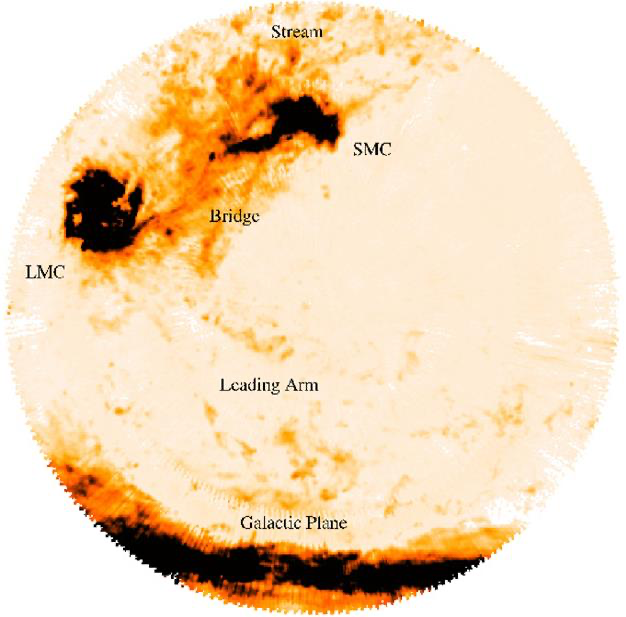

### 4.1.2 变星作为“标准烛光”

1. 本星系群中星系测距

* 星团测距：近邻星系星团的单个恒星可区分，利用这些星团观测的color-magnitude图，可以获得星团的年龄、金属丰度和距离（测光视差法）
* 变星测距：利用天琴座RR型变星和造父变星，测量本星系群的星系距离

2. 天琴座RR型变星

* 位于脉动水平支、核区正在燃烧氦的小质量（～0.5M$_\odot$）恒星
* 具有相近的绝对星等L$\approx$50L$_\odot$，周期T<1天，多出现在球状星团中。

3. 脉动不稳定带：

   > 赫罗图上接近垂直的，脉动变星分布的区域，底部在赫罗图上的赫氏空隙。
   >
   > 不稳定带的恒星脉动，起因于氦（双电离He比单电离He不透明度大）-- 恒星物理

4. In some special states, the stellar material can become more opaque when it is heated（如电离He）, as is the case for many stars in the instability strip.
5. Generation of oscillations in the stellar structure：

* Consider a layer of such material that has lost support against gravity and is moving inwards（引力>压力）
* As it shrinks, the layer is compressed and heated up, therefore becomes more opaque（He2+ ，不透明增大）
* Since it is now more difficult for photons to diffuse through the layer, heat will build up below it（光不容易传出去）
* The rising pressure below the layer will eventually halt the contraction and push it outwards（热压增加，膨胀）
* As the layer expands, its temperature drops and it becomes more transparent to radiation. （膨胀、降温、He+ ，不透明度减小、光子更容易传出去）
* This increased transparency allows radiation in the inner region to diffuse outwards more freely, thereby decreasing the pressure support to the layer.
* As the layer loses pressure support, it falls back, and the cycle repeats.

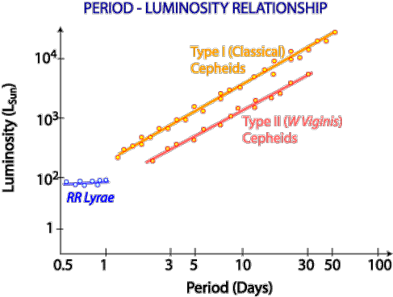

6. **周期P-光度L关系**：

* 脉动周期P与密度$\rho$的关系：P与$\rho$成反比；

* T$_{eff}$几乎不变，膨胀体积增大，光度L上升；体积增大，恒星平均密度下降，即L与密度$\rho$成反比。

#### 经典造父（I型造父）变星

* 是星族I（年轻、富金属）恒星的变星：M～4-20M$_\odot$，L～$10^5$L$_\odot$；光变周期T～1.5-50天

#### II 型造父变星

* 是星族II（年老、贫金属）恒星的变星，小质量（M～0.5M$_\odot$）；光变周期T～1-50天

Leavitt （1912） 发现周期-光度关系：LMC中越亮的造父变星，变化周期越长

> 利用变星测距须 注意：1) 金属丰 度对星光输出影 响；2)星际尘埃 对星光吸收散射

### 4.1.3 矮椭球星系

#### 定义

1. 银河系伴星系还包含至少十个矮 椭球星系，应该还有的没被发现
2. 以矮星系出现的星座命名，如：
   * 玉夫座 (Sculptor，1938年发现)
   * 天炉座 (Fornax，1938) 
   * 人马座 (Sagittarius ，1994) 
   * 大熊座 (Ursa Major，2005) 星系
3. 矮椭球星系的面亮度大约比麦哲 伦云低数百倍，很难发现
4. 矮椭球星系内气体、尘埃少；几乎没有年轻的恒星；全都含有一些非常老的恒星：形成早
5. 矮椭圆星系：小的椭圆星系，dE（如M32）。dE的特性与普通E差别大
6. 矮椭球星系：面亮度更暗的矮椭圆星系，记作 dSph，本质和 dE无区别

#### 矮星系、核星团、球状星团的比较

1. 矮星系和球状星团质量相近，但空间尺寸差别很大:小的矮椭球星系只有大的球状星团那么亮，但半径要大得多
2. 矮椭球星系是真正的星系，多数矮星系内部有球状星团存在
3. 矮星系并不是一次就形成了它们所有的恒星：它们全都包含着在数十亿年间从具有不同重元素丰度的气体中诞生的恒星

> 矮椭球星系中有大量暗物质，球状星团中没有

#### 矮椭球星系颜色-星等图

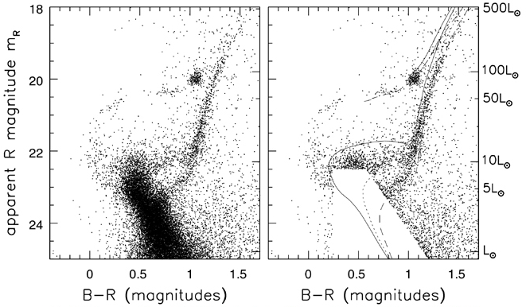

> 左图：船底座矮椭球星系中恒星颜色-星等图
>
> 右图：叠加了年龄不同的贫金属 星（Z＝Z⊙ /50）等龄线

1. 颜色星等图显示，矮星系有不同年龄的星族：2%的恒星 t < 2.5Gyr, 其余 恒星在 T ~ 3/7/15Gyr 前的3次暴发中诞生

2. 所有的矮椭球星系 ，重元素丰度低 ， 最亮的矮椭球星系的元素丰度 ~1/30 Z⊙ ：星系越暗，金属丰度越低

3. 贫金属原因：形成恒星困难；引力弱，金属增丰的气体丢失到星系际空间

   

## 4.2 ¶本星系群中的旋涡星系

### 定义

1. 本星系群含有3个大的旋涡星系：银河系(MW)、M31和M33 (LMC, SBm)

   > M31距离 d = 770 kpc ( ~2.5 百万 lyrs )，是肉眼能够看见最远天体 (SMC) 
   >
   > M33距离 d = 730 - 940 kpc ；~ 3 百万 lyrs，光度比M31暗，故难认得多
   >
   > 通过比较MW、M31和M33的特性：了解旋涡星系的共同性质和不同性质

Interstellar extinction curves of the Milky Way (R V = 3.1, 4.4), SMC, and LMC.

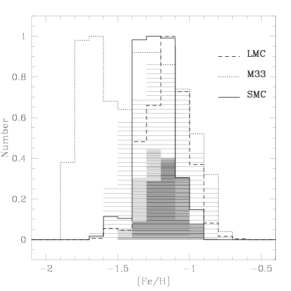

Metallicity distribution for the LMC (dashed line), M33 (dotted line) and the SMC (continuous line).

### 4.2.1 室女座星系 M31

1. M31在很多方面，都是一个比银河系大的星系

* 质量M = 1.5×10 12 M⊙ ，M(MW) = 8.5×10 11 M⊙ 

* M31中有10$^{12}$ 个恒星，银河系有2–4 ×10$^{11}$ 个恒星
* M$_V$ =−21.52，L V = 3.64×1010 L ☉ (MW M V =−20.9)
* 盘中恒星旋转快，V~260 km/s (MW V~220 km/s)
* 已知的球状星团约 460 个（超过银河系中的2倍）
* M31中央核球占其总光 度的比例大于银河系的 相应值，~ 30％－40％
* 核球在紫外波段很暗， 几乎不含年轻恒星
* 核球含有稀薄的电离气 体，以及少量较密的 HI 气体尘埃云。

2. 伴星系包括椭圆星系M32，3个dE，~10个dSph

#### M31的结构

1. 星系核

* HST观测发现，M31核有两个相隔约 0.5″ 或 2pc光斑 一个是致密的中心天体，质量MBH ∽ 2×10$^8$ M⊙ 黑洞 另一个可能是在动力学摩擦影响下已旋入中心的星团 与银河系不同，M31 核没有气体和尘埃（或含量少）

2. 球状星团

* M31 的贫金属球状星团遵循随机运动轨道；星团系统很少或几乎没有显示出有序转动。
* 与银河系不同，M31中球状星团的年龄分布很广，除了年老球状星团，也有较年轻球状星团：吞食其他星系？

3. 气体

* HI质量约 4 - 6×10 9 M⊙ ， 集中于 r ~ 10 kpc 处的环形恒星形成区。SFR ~ 1 M ⊙ /yr （MW SFR ~ 3-5 M ⊙ /yr ）

### 4.2.2 晚型旋涡星系 M33

1. M33是一个Sc或Scd型晚型旋涡星系：
   * 核球很小；旋臂开放且不平滑，主要由新近形成恒星的明亮蓝色聚集区组成
2. M33比银河系小且暗，只比LMC亮2 - 3倍： 恒星数4$\times$10$^{10}$个 (银河系2 - 4 $\times$ 10$^{11}$个)；盘的质量（3-6）$\times10^9$M$_\odot$，旋转速度V～120km/s。
3. M33比MW、M31 HI气体丰富

* HI气体质量 M ~ 3.2$\times$10$^9$M⊙
* 气体盘延展，> 3 R H(~ 30 kpc)

4. 分子气体少：几乎没有CO发射线

* 缺乏分子气体（年轻恒星诞生于 致密分子云） X
* CO对H2的比小于银河系中的值： 可能性更大 √

5. 星系核区

* 核区大小 r ~ 0.8 kpc，有一个亮的HII区， 有本星 系群中最亮的X射线源（1.2  10 39 erg s− 1 ）
* 无大质量黑洞存在的迹象：根据核区恒星运动 ，中心区域质量M < 3,000 M⊙ 

6. M33 中心有一个致密核心星团

* 比任何银河系球状星团都亮，其L V ≈ 2.5  10 6 L⊙  
* 星团核很小，恒星密度超过 10$^7$ L ⊙ pc- 3  
* 核星团有老年、中年和年轻恒星（非单代恒星）

7. 恒星形成

* 中心r < 4′ 区，原子气体变成分子气体效率高，有 强的CO辐射；r > 4′, HI转换为分子气效率略低
* 星系中~10% 的气体为分子态存在：恒星形成
* 单位面积的SFR比M31高：3.4 Gyr −1 pc −2 （M31: ~0.74)。SFR ~ 0.45 ± 0.1 solar masses per year.
* HI图像显示恒星形成区周围有空洞： feedback

## 4.3 ¶本群星系的形成

### 定义

宇宙膨胀温度降低，T ~ 350000 yrs，光子能量不能 电离氢和氦：质子和电子结合成中性原子，光子可自由传播：宇宙透明

气体不再受到光子压支持：高密区引力大，导致向 内塌缩：中心附近的团块相互吸引，并合成大星系 ；靠外团块则可能变成较小的伴星系 （原初星系）

早期宇宙小，原初星系彼此靠近，原星系的引力相 互拉拽：潮汐矩会拉着原星系慢慢转动起来

原星系内气体云彼此碰撞，它们会失去其部分能量 而内落；因角动量守恒，原星系的旋转逐渐增加。

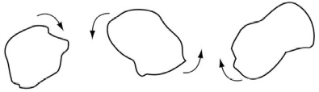

> 1） 物质密度涨落，引力导致 星云塌缩形成原初星系
>
> 2） 潮汐矩：不规则团块彼 此吸引，并开始旋转

### 4.3.1 银河系形成——塌缩模型

* 宇宙早期引力扰动导致星云塌缩，==形成==第一代恒星：超新星爆炸使得元素增丰，但金属丰度很低
* 贫金属气体云相互运动碰撞，压缩气体，==形成==球状星团、晕星：年老（宇宙早期）、贫金属
* 气体云在形成恒星前，还没有向中心下落太远： 球状星团和晕星的轨道取向随机；有序转动少
* 气体云坍缩时角动量损失缓慢 （垂直轴方向），沿着旋转轴方向下落：==形成==<u>有序运动扁平盘结构</u>
* 气体塌缩时标 t ~ 1/sqrt(ρ) ：密度较高云快速形成恒星，超新星爆炸使得气体进一步增丰，厚盘星
* 厚盘超新星爆发，增丰气体。气体进一步下落， 星系逐渐变为扁平状，==形成==由离心力支撑的薄盘
* 薄盘星开始诞生：较早代恒星产生的重元素已使气体增丰，薄盘星年轻、金属丰度高、有序运动

??? Model, numerical simulation? N-body? 

#### 核球恒星

* 银河系核球区域的颜色—星等图 （HRD）显示，其没有水平支星	
  * 极少有核球的恒星能够像球状星 团中的恒星那么老 T~ 13 Gyr
  * 绝大多数核球恒星的年龄T < 8 10 Gyr，有些可能更年轻

  > 致密的中央核球一旦形成，整个银河系的引力束缚其气体：俘获超新星增丰的气体，不断形成大量富金属恒星。

* 不清楚核球中恒星是如何形成的? still remain unclear

  * 形成于星系气体致密中心
  * 从星系盘较密的内区长出
  * 致密星团遗迹：动力学摩擦进入星系中心

#### 星族：Pop I 和 Pop II

* 星族指中年龄、化学组成、空间分布与运动特 性较接近的恒星集合。星族可分为三类：

  * 星族 I：<u>年轻恒星，形成较晚，金属丰度高 ，圆轨道</u>。位于银盘、旋臂等区域

    > 极端（Extreme）：位于旋臂，3%金属丰度，圆轨道，100 million yr。
    >
    > Intermediate：位于银盘，1.6%金属丰度，稍椭圆轨道，0.2-10 billion yr。

  * 星族II：<u>年老恒星，形成较早，金属丰度低 ，随机运动</u>。位于星系晕、核球等区域

    > 极端：
    >
    > Intermediate：

  * 星族III：诞生于<u>宇宙极早期，零金属、大 质量的恒星</u>。*没有被发现，理论预言。*

#### 银河系 – 继续构建

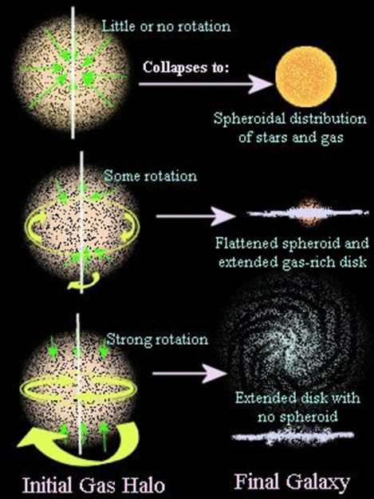

### 4.3.2 重元素的合成

#### 形成过程

* 原初气体$\Rightarrow$第一代恒星$\Rightarrow$合成 重元素$\Rightarrow$ SN爆炸$\Rightarrow$星际介质 丰度增加$\Rightarrow$第二代恒星 $\Rightarrow$...

* 恒星燃烧H、He气体，形成重元 素：恒星年龄与金属丰度相关； 较老恒星几乎不含金属，年轻恒 星则有较高金属丰度à化学演化

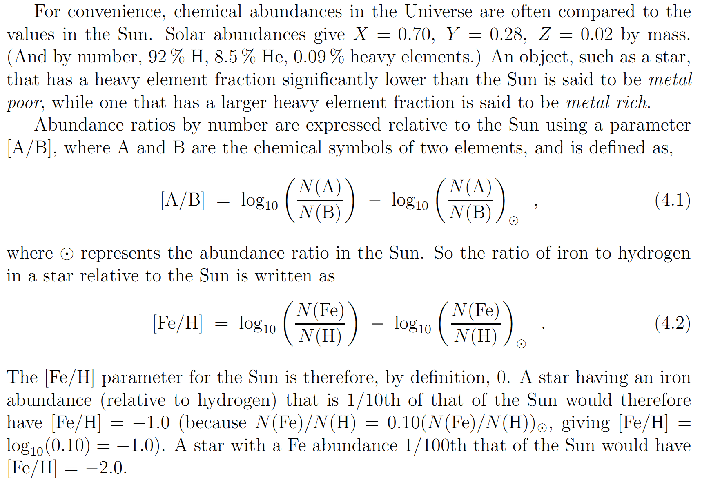

> 三种元素表达方式：By mass，By number，By metal poor

#### The Closed Box Model

> 只考虑1和2的过程

Intergalactic medium（IGM），Interstellar medium（ISM）

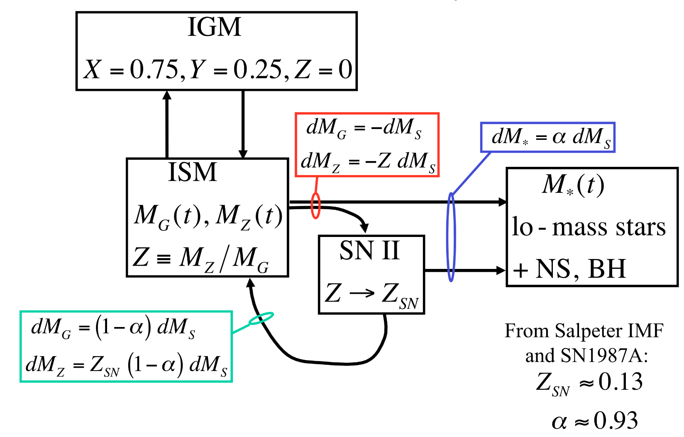

Processes that alter the metalicity:

1. Type-II SNe enrich the ISM
2. Low-mass stars form
3. Primordial gas
4. ISM ejected

#### 单区瞬时循环模型——化学演化

##### 定义

> one zones, instantaneous recycling, closed box model

假设

* 星系的气体充分混合，处处具有相同化学组成
* 恒星将它们核聚变的产物瞬时返回到星际气体
* 无气体从星系逃离，也无气体流入：闭区模型
* 所有比氦重的元素，彼此保持完全相同的比例

> Mg(t)：t时刻，星系(ISM)中气体的质量；
>
> M* (t)：t时刻，小质量恒星和恒星遗迹质 量（被锁定在这些天体中的物质质量);
>
> Mh (t)： t时刻，星系气体(ISM) 中比氦重 的元素总质量;
>
> Z(t) = Mh(t) / Mg(t)，气体的金属丰度

时刻t，星系中形成了质量为Δ′M* 的恒星。大质量恒星SN爆炸后，留下质量 ΔM * 在小质量恒星和遗迹中，向ISM中返回（瞬时）重元素质量为 pΔM* 气体

产额（stellar yields）P：

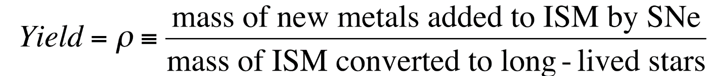

星际气体中的重元素质量Mh 变化：大质量恒星产生的重元素返回 pΔM* )，被 锁定在小质量恒星和遗迹中的重元素(ZΔM*)：

Mh为星系气体中比氦重的元素总质量

气体中的金属丰度增加量：

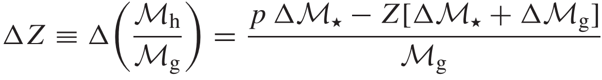

如果没有气体进入或离开系统（闭区），则气体和恒星总量保持不变：

ΔM*＋ΔM g= 0 → ΔZ/ΔM *= p/M g→ ΔZ/ΔM g= − p/Mg

如果p不依赖于Z，积分ΔZ/ΔM g = − p/Mg ， 可得到气体中的金属丰度随时间变化：

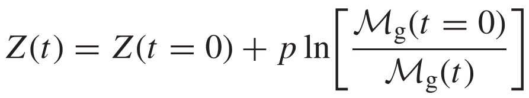

随着恒星形成和气体耗尽，气体的金属丰度随时间增加

时刻t，星系中气体的质量$M_g(t)$、金属丰度$Z(t)$；时刻t之前形成的恒星金属丰度小于$Z(t)$，恒星质量为$M_\star(<Z)$，则有$M_\star(<Z)=M_g(t=0)-M_g(t)$：
$$
M_\star(<Z) = M_g(0)[1-exp{-[Z-Z(0)]/p}]
$$
M* (<Z)不显含时间t；时刻t之前形成的、长寿命（小质量）恒星的质量，只 依赖于t时刻，星系中金属丰度为Z气体量Mg (t, Z) 。
$$
Z(t)=Z(t=0)+pln[{M_g(t=0)\over{M_g(t)}}]\\
M_{\star}(<Z)=M_g(0)[1-exp{-[Z-Z(0)]/p}]
$$
当星系中所有气体都形成恒星、气体耗尽，金属丰度介于 Z 和 Z＋ΔZ 之间 的恒星质量（方程微分）：

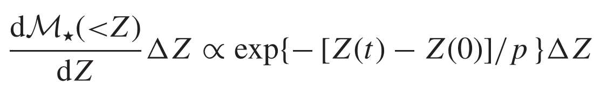

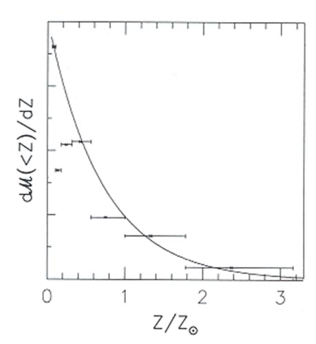

$dM_\star(<Z)/dZ$随着Z指数下降。

##### 模型检验（I）

M33中盘气体的金属丰度（氧元素O、氮元 素N）与随半径(R/R25 )的变化关系

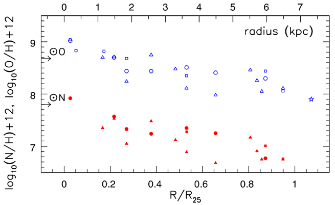

在旋涡星系外盘等富气区域，恒星和气体是 相对贫金属的：与恒星形成相关的气体密度 高的地方，重元素的平均丰度低预言一致。

银河系核球（Baade’s Window ） 中G和K型巨星的数目随Z分布:

下图左图是每个 Z/Z⊙ 区间的相对数目；

右图为每个 [Fe/H] 间隔内的数目实线为模型：
$$
p = 0.5Z_⊙ ，Z(t=0) = 0
$$

银河系核球中G和K型巨星的金属丰度：核球可能成功地留住了所有气体，并完全将其变成了恒星$\rightarrow$所以观测结果能够与单区瞬时循环模型预言复合较好。

推导产额p？

盘中靠近太阳的气体平均金属丰度含量大约在Z~0.7 Zsun

初始的气体质量$M_g(t=0)=M_{\star}(today)+M_g(today)$

> 其中，M$_\star(today)\sim40$Msun/pc$^2$，M$_g(t=0)\sim10$Msun/pc$^2$

假设Z(t=0)=0，可以推导出p=0.7ln(50/10)~0.43 Zsun

产额p: 特定元素丰度、质量为m的恒星，向ISM返回的重元素质量与保留在 小质量恒星和恒星遗迹中ISM质量之比

产额p依赖于初始质量函数、核燃烧的细节、恒星物质中角动量的分布、金 属丰度、恒星磁场以及恒星在密近双星中的比例

##### 模型检验（II）——太阳附近

太阳附近，银盘含有：

* 恒星 ~ (30−40) M⊙ pc- 2 ，气体 Mg (t) ~13 M ⊙pc -2，Mg(t=0) ~ 50 M⊙pc-2

局域盘气体具有大致同太阳一样的平均丰度：\<Z\> ~ Z⊙ 

如果 Z(t=0) = 0，原初气体中不含重 元素。假设没有气体进入或离开太阳邻域，则有：

当p = 0.74 Z⊙时，贫金属盘星比例：
$$
{M_\star(<Z_\odot/4)\over{M_\star(<Z_\odot)}}={1-exp[-Z_\odot/(4p)]\over{1-exp(-Z_\odot/p)}}\approx0.4
$$
观测太阳邻域 132 颗 G 型矮星 样本，发现只有 33 颗小于太 阳铁丰度的 25％，并且只有1 颗小于太阳氧丰度的 25％。

观测与闭区模型矛盾： G 型矮星问题

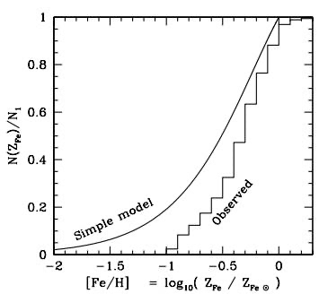

对于太阳邻域，闭区模型给出太阳附 近局域盘星几乎一半有 Z < Z⊙ /4。

##### G-dwarf Problem -- 解决办法

$$
M_\star(<Z) = M_g(0)[1-exp{-[Z-Z(0)]/p}]
$$
形成恒星的气体金属丰度Z(t=0)不等于0：

* 以前恒星产生的重元素已同形成盘的气体混合，使其''预增丰"
* 令 Z(t=0) ≈ 0.15 Z⊙，可以近似给出局域金属丰度的观测分布

气体外流、内落存在：闭合假定不成立

* 外部贫金属气体的内流，阻止丰度上升得像闭区模型预言的那样快
* 矮星系或者星团等引力势不足于束缚其中气体，发生外流，带走重元素
* 外流和内落，导致形成恒星的气体金属丰度不均匀：瞬时混合假定不成立

##### 内流（Inflow）和外流（Outflow）的模型

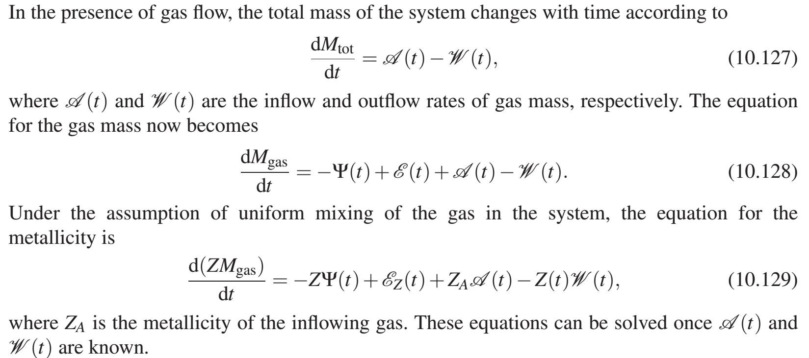

##### 贫金属星$\alpha$元素增丰

不同金属丰度恒星的氧元素与铁 元素丰度比[O/Fe]：贫金属星中 氧相对于铁更丰富

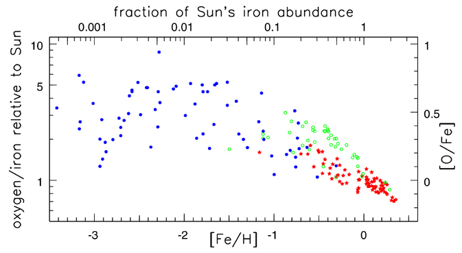

> 蓝色点：银晕中的恒星
>
> 绿色点：厚盘星
>
> 红色点：薄盘星

$\alpha$元素和Fe元素产生机制不同

> $\alpha$元素：He

* 星际气体中的铁元素主要是由Ia型超新星爆炸释放到ISM中，发生SN Ia爆炸的恒星为小质量恒星，年龄在1 Gyr或以上
* 星际气体中a元素主要II型超新星爆发时抛到ISM中，II型超新星为大质量恒星产物（T < 100Myr）：SN II 的Fe 保留在中子星、黑洞中
* 贫金属晕星形成的早（t < 1Gyr），Ia型超新星还没有开始把铁加入星际气体中：a元素同铁的比[a/Fe]要高于在太阳中的值
